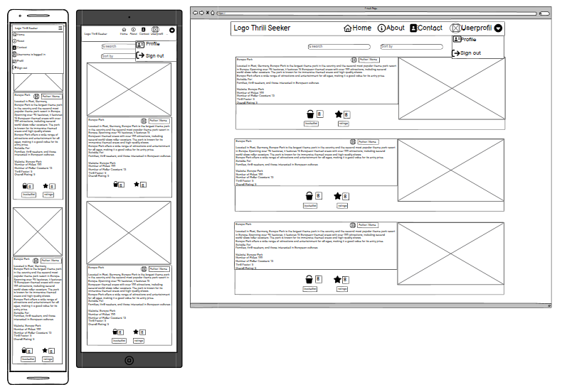
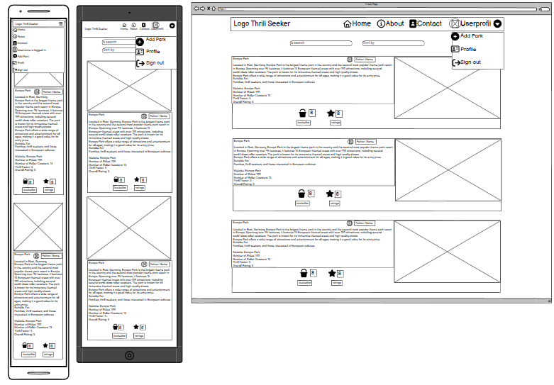
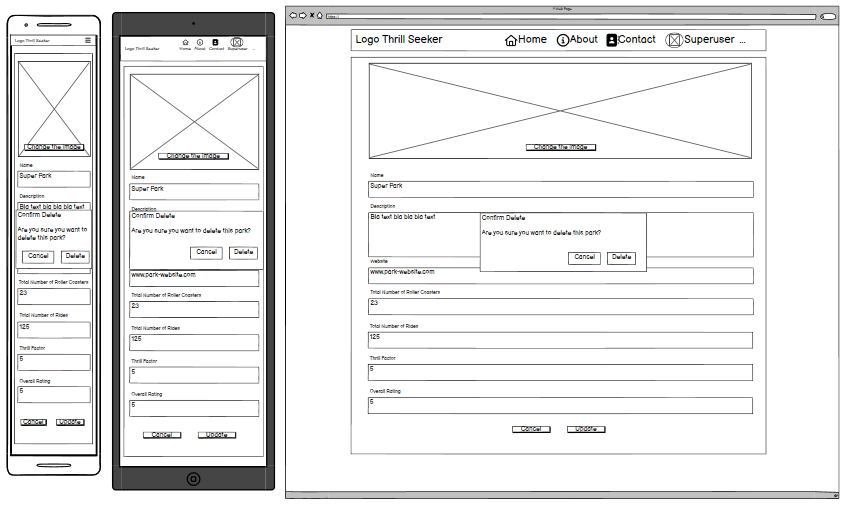
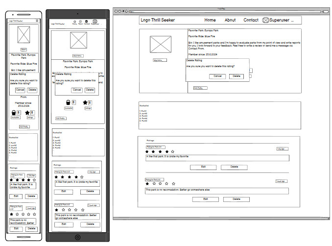
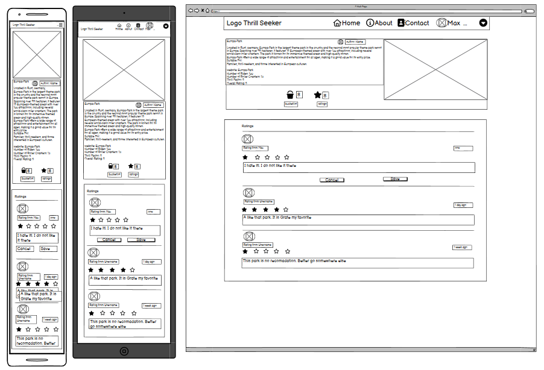

# Thrill Seeker Readme

ThrillSeeker is a website that publishes articles about theme parks. Each park is rated and tips and recommendations are given for which target group the park is best suited.

At ThrillSeeker, a passionate team of adrenaline junkies and theme park lovers use their extensive park hopping experience to provide insight and accurate details about each park reviewed. Their unwavering enthusiasm for thrills and dedication to accuracy make ThrillSeeker the ultimate source for in-depth theme park reviews.
Users can create a bucket list, rate parks themselves and send a message to the operators via the contact form. Thrill Seeker - The Ultimate Guide to Adventure!

All other relevant files can be found here:  
[Live website](https://thrill-seekers-af06984a9bdb.herokuapp.com/)  
[Repository](https://github.com/SureDeveloping/thrill-seekers)  
[APi](https://thrill-seekers-api-5fd87044d4ac.herokuapp.com/)  
[API Repository](https://github.com/SureDeveloping/thrill-seeker-drf-api)  

## Content
- [UX - User Experience](#ux---user-experience)
    * [Project goles](#project-goles)
    * [Target audience](#target-audience)
    * [User requirements and expectations](#user-requirements-and-expectations)
- [Agile approach](#agile-approach)
- [Design](#design)
  * [Colour scheme](#colour-scheme)
  * [Typography](#typography)
  * [Imagery and icons](#imagery-and-icons)
- [Wireframes](#wireframes)
- [Features](#features)
  * [Implemented features](#Implemented-features)
  * [Future features](#future-features)

- [Component architecture and reusability](#Component-architecture-and-reusability)

- [Technology used](#technology-used)
  * [Languages](#languages)
  * [Frameworks and database](#frameworks-and-database)
  * [Libraries and packages](#libraries-and-packages)
  * [Software and tools](#software-and-tools)

- [Deployment](#deployment)
  * [Preparation for heroku depolyment](#preparation-for-heroku-depolyment) 
  * [Deploying on heroku](#deploying-on-heroku) 
  * [Fork this repository](#fork-this-repository) 
  * [Clone this repository](#clone-this-repository) 

- [Testing](#testing)
- [Credits](#credits) 
  * [Content](#content) 
  * [Media](#media) 
  * [Code](#code) 
- [Acknowledgments](#acknowledgments)

## UX - User Experience

### Project goles
Thrill Seeker: The Ultimate Guide to Adventure
The name is both the program and the motto. Thrill Seeker is all about offering thrill seekers a platform to discover theme parks, make a note of them for future visits, exchange reviews, and find out which park they might like to visit next. The website features intuitive navigation, ensuring users can easily find the information they need with minimal effort. With its responsive design, the site provides an optimal viewing experience across a wide range of devices, from desktop computers to mobile phones. The platform offers engaging content that is crafted to be informative and keep users interested, encouraging them to explore more. Personalization is a key aspect, allowing users to create profiles, put favorite parks an a bucketlist, and write reviews, tailoring their experience to their preferences.

The gole is it to provide a comprehensive platform for thrill seekers to discover, review, and plan visits to theme parks.
- Enhance user engagement through interactive features and personalized content.
- Ensure accessibility by making the platform user-friendly and responsive.
- Foster a community of thrill seekers who can share their experiences and recommendations.

### Target audience
- People looking for exciting experiences in theme parks.
- people who want to share, rate and exchange experiences about their park visits
- people who are planning future trips to theme parks and want to discover new attractions and roller coasters.

### User requirements and expectations
As a first time user of the Thrill Seeker website I want to:
- Understand what the website is about and its purpose
- Register, login and logout
- Browse and read theme parks articels and ratings
- Save theme parks to my bucketlist
- Fill my personal user profile, which was created automatically with the registration, with personal data
- A message to the operator via the contact field

As a frequent user of the Thrill Seeker website, I want to:
- Login and logout easily
- Update my user profile
- Write and edit my ratings of theme parks
- View my favorite parks pages which are on my bucketlist
- Discover new theme parks
- Send another message to the operator via the contact field

As operator of the Thrill Seeker website I want to:
- Provide an easy to navigate and intuitive website
- Ensure responsive design for various devices
- Offer real-time updates on theme park information
- Implement a robust search system
- Maintain user data privacy and security
- Provide the ability to create, read, update, and delete user-generated content
- Continuously improve the platform based on user feedback
- Keep the articles up to date and provide reliable information
- Test more parks and add more reviews to the website

## Agile approach
This application was developed by using an Agile apporoch. At the beginning, a list was created in which epics userstory and task were collected. These were evaluated using the Moscow Method, into three levels of importance: 'Must Have', 'Should Have', 'Cloud have#, and 'Will not have (wish to have)'.The Wish to have user story are elements that can be implemented in future releases.  
All others and the user stories for the backend can be found on this [project board](https://github.com/users/SureDeveloping/projects/6/views/1). 

| Epic                  | User Story                                                                                                                                                                      | Acceptance Cretary                                                                                                                                                                                                                                                                                                                 | Tasks                                                                                                                                              | Moscow        |
| --------------------- | ------------------------------------------------------------------------------------------------------------------------------------------------------------------------------- | ---------------------------------------------------------------------------------------------------------------------------------------------------------------------------------------------------------------------------------------------------------------------------------------------------------------------------------- | -------------------------------------------------------------------------------------------------------------------------------------------------- | ------------- |
| Navigation            | As a user I can view the navbar from every page so that I can navigate easily between pages                                                                                     | AC1: The nagiation bar is clearly readable on every page AC2: The navigation bar is responsive AC3: I can navigate between pages without refreshing the page                                                                                                                                                                 | T1: Create Navabar and Navbar Links T2: Add a responsive bootstrap react template to make it responsive T3: Add routing to the nav bar links | Must Have     |
| Navigation            | As a user, it is displayed whether I am logged in and the navigation bar adapts to my status so that I only see relevant links and can navigate even easier                     | AC1: When I am logged in I see the logout link. AC2: When I am logged in I see my user name  in the navbar. AC3: When I am logged out I see the login and register link                                                                                                                                                      | T1: Hide and show only the corresponding links in each status T2: Paste the user name if the user is logged in                                  | Must Have     |
|                       |                                                                                                                                                                                 |                                                                                                                                                                                                                                                                                                                                    |                                                                                                                                                    |               |
|  Authentication       | As a user I can create an account to log in so that i can use limited functions for logged in users                                                                             | AC1: There is a registration form on the website which I can fill in. AC2: The data will be saved in the database                                                                                                                                                                                                               | T1: Creating a form T2: Linking the form to the navbar T3: Styling the form with bootstrap react T4: Create Conection to the backend      | Must Have     |
|  Authentication       | As a user I can log in so that I can access all features for logged in users                                                                                                    | AC1: There is a login form on the website which I can fill in. AC2: The data will be saved in the database                                                                                                                                                                                                                      | T1: Creating a form T2: Linking the form to the navbar T3: Styling the form with bootstrap react T4: Create Conection to the backend      | Must Have     |
|                       |                                                                                                                                                                                 |                                                                                                                                                                                                                                                                                                                                    |                                                                                                                                                    |               |
| Parks overview        | As a user I can read all Park articles sorted by publication date so that I always get the latest article first                                                                 | AC1: The articles are displayed in order of creation date                                                                                                                                                                                                                                                                          | T1: Add sort function                                                                                                                              | Must have     |
| Parks overview        | As a user, I can search for keywords so that I can find the park that interest me the most.                                                                                     | AC1: A search bar is available on the website AC2: I can enter what I am looking for.                                                                                                                                                                                                                                           | T1: Add search bar T2: Ensuring the function of the search bar                                                                                  | Could have    |
| Parks overview        | As a user, I can filter the parks by bucektlist count, rating count, thrillfactor and overall rating so that I can find park that interest me the most.                         | AC1: A filter dropdown is available on the website AC2: I can choose between the filter                                                                                                                                                                                                                                         | T1: Add filter dropdown bar T2: Ensuring the function of the filter T3: Style the filter                                                     | Could have    |
| Parks overview        | As  user, I can see the park that have been rated and have been put in a bucketlist so that I can form a better opinion about a park and decide which one I want to visit next. | AC1: Parks have a rating counter. AC2: Parks have a bucketlist counter to the park.                                                                                                                                                                                                                                             | T1: Add a bucketlist and a rating counter                                                                                                          | Could have    |
| Parks overview        | As a user, I can scroll through the articles on the website, which are automatically loaded, so I don't have to click on buttons and change pages.                              | AC1: I can scroll without clicking and without having to stop                                                                                                                                                                                                                                                                      | T1: Add scroll function                                                                                                                            | Should have   |
|                       |                                                                                                                                                                                 |                                                                                                                                                                                                                                                                                                                                    |                                                                                                                                                    |               |
| Park detail page      | As the supersuer I can create a park article to expand the website content                                                                                                      | AC1:There is a form to fill out an create a new park with all avalable fields                                                                                                                                                                                                                                                      | T1: Create a create park form                                                                                                                      | Must have     |
| Park detail page      | As a user, I can call up a detail view for a park so that I can read all the information about the park.                                                                        | AC1: I can access a detail view of each park via a link AC2: The page has a bootstrap styling                                                                                                                                                                                                                                   | T1: Create detailed view T2: Styling detailed view                                                                                              | Must have     |
| Park detail page      | As the author of the article, I can edit the entry for the park so that it can be corrected and updated.                                                                        | AC1: I can go to an update page and update the information about a park.                                                                                                                                                                                                                                                           | T1: Create update page                                                                                                                             | Must have     |
| Park detail page      | As the author of the article, I can delete the entry for the park if a park is closed and no longer exists                                                                      | AC1: The author can delete his article                                                                                                                                                                                                                                                                                             | T1: Integrate delete function                                                                                                                      | Must have     |
|                       |                                                                                                                                                                                 |                                                                                                                                                                                                                                                                                                                                    |                                                                                                                                                    |               |
| Bucketlist            | As a logged in user I can put a park on my bucket list so that I have a list of parks I still want to visit                                                                     | AC1: I can add a park to my bucket list                                                                                                                                                                                                                                                                                            | A1: Create an overview view with all parks on my bucket list                                                                                       | Must Have     |
| Bucketlist            | As a logged in user I can delete a park from my bucket list so that I can update my list if i change my mind                                                                    | AC1: I can delete a park from my bucket list                                                                                                                                                                                                                                                                                       | A1: Creating the delete function of parks in my bucket list                                                                                        | Must Have     |
|                       |                                                                                                                                                                                 |                                                                                                                                                                                                                                                                                                                                    |                                                                                                                                                    |               |
| Rating a park         | As a logged in user, I can rate a park and give my opinion in a text field so that I can share my opinion and experience with others.                                           | AC1: I can give a rating when I am logged in. AC2: I can write a text in a text field AC3: I can see when the rating was last edited or created.                                                                                                                                                                             | T1: Create a 5 Star rating T2: Hinzüfgen eines Textfeldes für einen Kommentrat                                                                  | Must Have     |
| Rating a park         | As a logged in user, I can update my created rating so that I can change my mind and share my new opionen                                                                       | AC1: I can update my rating                                                                                                                                                                                                                                                                                                        | T1: Add update function                                                                                                                            | Must Have     |
| Rating a park         | As a logged in user, I can delite my created rating so the rating is not visible anymore                                                                                        | AC1: I can delete my rating                                                                                                                                                                                                                                                                                                        | T1: Add delite function                                                                                                                            | Must Have     |
|                       |                                                                                                                                                                                 |                                                                                                                                                                                                                                                                                                                                    |                                                                                                                                                    |               |
| About page            | As a users I can read on the about page what the purpose of the website is so that I am informed whether the site fits my requirements                                          | AC1: About page with a bootstrap styling is accessible to everyone and can be read.                                                                                                                                                                                                                                                | T1: Create an about page with appropriate text and styling                                                                                         | Could have    |
|                       |                                                                                                                                                                                 |                                                                                                                                                                                                                                                                                                                                    |                                                                                                                                                    |               |
| Contact form          | All users can send a message to the admin  (saved in the Database)  via the contract form so that I can give a feeedback and send my wishes for the next park article           | AC1: Contact Form page with a bootstrap styling is accessible to everyone and can be filled out and submitted. AC2: I get feedback when I have submitted the form.                                                                                                                                                              | T1: Creating a contact form with Bootstrap styling. T2: Show feedback message when the form has been sent.                                      | Must have     |
| Contact form          | As a user, I can view the sent data again, update it and delete it before it is saved permanently.                                                                              | AC1. The user is taken to a page where the data he has entered is displayed AC2: The user can update the data from there on another page. AC3: The user can after saving, view the data again. AC4: The usercan delete the data. AC5: The user can leave via confirm data the page and then no longer change the data. | AC1. Creating the comment edit page AC2: Create the comment page where the data can be read AC3: Create the user notifications.              | should have   |
|                       |                                                                                                                                                                                 |                                                                                                                                                                                                                                                                                                                                    |                                                                                                                                                    |               |
| User Profile          | As a user i can go to other user profiles so that I can find more informations about the specific user                                                                          | AC1: I can go to userprofiles via links in ratings and park artikel                                                                                                                                                                                                                                                                | T1: Create a user profile detal page                                                                                                               | Should have   |
| User Profile          | As a user, I can view all ratings and bucketlist items of a particular user when I am on their profile, so that I can read more from that person                                | AC1: All ratings and bucketlist items that belong to the user profile are listed under the profile. AC2: The listed points are styled with bootstrap                                                                                                                                                                            | T1: Add filters and list ratings and articles to the userprofile page                                                                              | Should have   |
| User Profile          | As a logged in user, I can update my user profile so my details are up to date                                                                                                  | AC1: I can update a user profile                                                                                                                                                                                                                                                                                                   | T1: Create user profile update page                                                                                                                | Should have   |
|                       |                                                                                                                                                                                 |                                                                                                                                                                                                                                                                                                                                    |                                                                                                                                                    |               |
| Like a rating         | As a logged in user I can like a park rating so that i can share my sympathy for a rating                                                                                       | AC1: I can like a rating when I am logged in. AC2: I can remove my like again                                                                                                                                                                                                                                                   | T1: Create like button and make it clickable                                                                                                       | will not have |
| Messages user to user | As a User i would like to contact other user by personal message to organises offline meetings and more personaöl exchange                                                      | AC1. As autorised user i can send a messege to a other autorised user                                                                                                                                                                                                                                                              | T1: Create a Messages Form                                                                                                                         | will not have |
| Messages user to user | As a User i would like to reseave messsages from other user to organises offline meetings and more personaöl exchange                                                           | AC1. As autorised user i can resave messeges from other users AC2 I get a notification when a message comes in the mailbox:                                                                                                                                                                                                     | T1: Create a mailbox for incoming message T2: Create a Notoification when i message comes in                                                    | will not have |
| User Profile          | As a user, I would like to have an overview of all the user profiles that exist so that I can network with them better                                                          | AC1 There is an overview page with all existing user profiles                                                                                                                                                                                                                                                                      | T1: Create a profiles overvie page                                                                                                                 | will not have |
| User Profile          | As a autorised user I can search and filter these profiles to find people who have the same interests as me                                                                     | AC1 I can filter through all user profiles AC1 I can search through all user profiles                                                                                                                                                                                                                                           | T1: Create a filter function for user profiles T2: Create a search function for user profiles                                                   | will not have |

## Design
### Colour scheme
I used the website [coolors](https://coolors.co/)  to find colors that go good together. These should always make a warm, friendly impression and invite users to spend time on the website.

Finally, I checked the contrast again with [Contrast-grid](contrast-grid.eightshapes.com/). 

### Typography
Two different fonts from [googlefonts](https://fonts.google.com/) were selected for the Thrill Seeker project.
For all headlines I chose the font family “Raleway”, a sans-serif font. I linked the name directly to railway tracks and therefore to tracks and speed, like on rollercoasters. At the same time, I really liked the font. 
I then looked for a suitable font for the rest of the text and the body on the website. I came across this [article](https://maxibestof.one/typefaces/raleway/pairing/roboto/) which combines the "Roboto" sans-serif font family with Raleway. This combination appealed to me and I like "Roboto". That's why I chose Roboto as the second font for the project.

### Imagery and icons
I have used various image sources for this project. 
I created the logo with the website [Logo](https://logo.com/). I used a variant of this for the profile_defauld image and the favicon. All other profile images for example accounts as well as the no_results image for an unsuccessful search are from the website [Freepiks](https://de.freepik.com/). The pictures on the About, Sign in and Sign up page are from the website [Pexels](https://www.pexels.com/de-de/). The images for the park articles are from the respective [Wikipedia](https://www.wikipedia.org/) pages of the free parks.
All icons on the website were used by [Fontawesome](https://https://fontawesome.com/icons/).

## Wireframes
In the planning process for this project, wireframes were subsequently created for the entire project. These are listed here sorted by page.  

| Page                           | Screanshot                                                                                                                                      |
| ------------------------------ | ----------------------------------------------------------------------------------------------------------------------------------------------- |
| Parks Page no User Signed in   | 

Parks Page no user signed in

     |
| Parks Page User Signed in      | 

Parks Page user signed in

           |
| Parks Page Superuser Signed in | 

Parks Page superuser signed in

 |
| About Page                     | 

About Page

                                           |
| Contact Form Create            | 

Contact Form create

                          |
| Contact Form Review            | 

Contact Form review

                          |
| Contact Form Update            | 

Contact Form update

                          |
| Contact Form Delete            | 

Contact Form delete

                          |
| Sign up Form                   | 

Sign up Form

                                   |
| Sign in Form                   | 

Sign in Form

                                   |
| Park Create                    | 

Park create

                                    |
| Park Update                    | 

Park update

                                    |
| Park Delete                    | 

Park delete

                                    |
| Park Superuser Signed in       | 

Parks Page superuser signed in

      |
| Userprofil                     | 

Userprofil

                                          |
| Userprofile Update             | 

Userprofile update

                           |
| Userprofil Rating Update       | 

Userprofil Rating Update

             |
| Userprofil Rating Delete       | 

Userprofil Rating Delete

             |
| Park Page Create               | 

Park Page Create

                    |
| Park Page Delete               | 

Park Page Delete

                    |
| Park Page Rating Update1       | 

Park Page Rating Update1

           |
| Park Page Rating Update2       | 

Park Page Rating Update2

           |
| Park Page no Rating Create     | 

Park Page no Rating Create

              |

## Features
### Implemented features
#### User account management
- Sign up: Users can create an account on the website to rate items and create a bucket list of parks they want to visit.
- Sign in: Users can log in to their Thrill Theeker account with their registered email and password to access personalised features.
- Sign out: Users can log out of their account. This way they are only logged in when they are actually using the site, making it safer to use. 
- Profile update: Users can update their profile information and publish some personal details if they wish.

#### Park article/review management
- Create a park article: Superuser, staff of the website operator can create a park article. This contains a photo, some facts about the park and an evaluation of the park by the author.
- View park articles: All users on the website can view park articles without logging in. All parks are listed one below the other in the overview on the homepage. By clicking on the link in the park name and in the park image, you can access the park details page.
- Update park articles: The creator of the article can update it, add content to make changes or additions.
- Delete park article: Creators can delete their own articles if they are no longer relevant because, for example, the park has been permanently closed.

#### Contact form management
- Create message via contact form:
Users can send a message to the site operator without logging in, which is then saved in the database. 
Review of the transmitted message:
The user is shown their sent data again for review. This process is secured by an edit token so that no third party can access it.
- Update of the transmitted message:
The user then has the opportunity to change the data again if they have made a mistake or forgotten something.
- Delete the transmitted message:
If the user changes their mind, they can also delete the entire message,
- Confrim the sent message:
If the user finally clicks on Confirm, they are redirected to the homepage. The message can only be changed once with the edit token. As the message has a large number of digits, it is almost impossible to guess and is therefore a good protection against misuse. The data can be read by superusers via admin panel.

#### Interactions and engagement
- Search: 
Users can search for authors of park articles, park names and park description content. Parks will only be listed if the search term is contained in one of the fields in a park.
- Sort: 
Users can filter and sort park articles by Bucketlist Count, Ratings Count, Thrill Factor and Overall Rating so that the parks with the highest ratings are listed first.
- Ratings: 
Logged-in users can rate park items. There is a star rating from 1 to 5 stars and a reason for the rating must be given. At the same time, the number of ratings is counted in a counter and displayed under the park and on the user profile.
- View ratings: 
Users can read reviews of park types to form a better opinion of the park and choose a park for their next visit.
- Update reviews: 
Users can edit or correct their own reviews to change their shared opinion. This way, the rating can be adjusted if something changes about the park and the park item.
- Delete review: Users can delete their own reviews to remove their previous statements. This will reduce the ratings counter.
- Add park to Bucketlist: 
Users can add parks to their bucket list. How many users have a park on their list is counted. It also counts how many parks a user has on their list. The respective list can be viewed on the user's profile. 
- Delete park from bucket list: 
Users can remove parks from their list, for example because they have visited the park. The counter is then reduced by 1 again.
- Administration for website owners: 
Parks can be deleted and edited, profiles can be deleted and edited, ratings can be deleted and edited and Bucketlist items can be deleted or added via the admin menu.

#### Navigation:
Each page has a navigation bar at the top that provides accessible functionality across the platform. In addition, buttons appear under elements that can be changed by a user depending on which rights they have. There are also links that lead from one journey to the next. For example, from the bucket list to the respective park or from the park overview page to the respective park detail pages. Navigation should be as intuitive as possible without having to open extra menus.

#### Unauthenticated users:
Unauthenticated users are presented with intuitive navigation bar with a logo and links to essential pages including 'About', 'Contact', 'Sign in', and 'Sign up'.

#### Authenticated users:
After successful signin, the navigation bar changes. Additional functions are made available for authenticated users. The ‘Sign in’ and ‘Sign up’ links disappear. However, some additional links will be provided, namely ‘Sign out’ and 'Profile'. In addition, a profile picture, avatar with the username of the logged in user will be displayed in the navbar.  
There are some additional options for authenticated users. It is possible to create, edit and delete ratings. This is possible via buttons that appear where it is possible to change something. Each user can only rate each park once. The user's options change accordingly. If a rating is created or deleted, the ratings count also changes.  
By clicking on the bucket list icons, you can also compile your own list which is displayed on the profile. If you click on the same icon again, the park will be removed from the bucket list. Of course, the bucket list count is also changed accordingly.  
A button will also appear on the userprofile with which the profile can be edited. 

#### Authenticated superusers:
Superuser, is staff 
In addition to the rights of normal users, superusers also have the option of creating part articles and writing a new review. This is reserved for staff members to ensure the quality of the articles. The superuser can also delete and edit articles via the button under his own article. 

### Future features
- It should be possible to like park ratings so that you can share sympathy for a rating. This function is already integrated in the backend and can therefore be implemented quickly in the frontend.
- It should be possible for users to send secure personal messages and contact each other to enable offline meetings and more personal exchange.
- It should be possible to get an overview of all existing user profiles to enable better networking. The profile data should be searchable to find users with similar interests

## Component architecture and reusability
Thrill Theeker is a web application that allows users to find out about, rate and share information about open air parks. The application's architecture consists of several reusable components that streamline development and ensure a consistent user experience.

### Core component
- Asset: This component manages the display of a spinner or an image along with an optional message. It is used in various parts of the application, e.g. ProfilesPage,  ParksPage, ParkPage, ParkCreateForm,  to provide visual feedback when loading data.
- Avatar: This component displays users' profile pictures. It is reused in the NavBar, park, RatingPark and in RatingsCreate Form.
- NavBar: The Navbar is used on every page. This is necessary for seamless navigation through the app.
- StarRating: The Star Rating is used on Rating Create Form, Rating EditForm, RatingPark and on the RatingProfile. It generates the 5 star rating.

### Component Pages

Authentication:  
- Sign in & SignupForm: Components handling user authentication processes.

Ratings:  
- Rating: Used to display user ratings.
- RatingCreateForm & RatingEditForm: Forms used for creating and editing ratings.
- RatingPark: Used to display and integrate ratings on the park detail page.
- RatingProfile: Used to display and integrate ratings in the profile page.

Parks:  
- Parks: Component to display the park articels.
- ParkCreateForm & ParkEditForm: Forms used for creating and editing parks.
- ParkPage: Detailed view of a specific park. Also the specific ratings belonging to the park are added here via RatingsPark.
- ParksPage: It lists all Parks articles one below the other and is at the same time the homepage of the project.

Profiles:  
- ProfilesEditForm: Form for editing the user profile.
- ProfilesPage: Is a page on which all profile data is displayed. In addition, ratings created by the user are displayed under the profile via RatingProfile.

Contacts:  
- ContactFormCreate: Used to create a contact message for the website operator.
- ContactFormEdit: This form can be used to change the message.
- ContactFormView: The just created or updated contact form data can be displayed again via this page.

About:  
- Webpage that displays information about the application and other relevant context for users.

404:  
NotFound: A page that is displayed as soon as a url ending is called up that does not exist.

## Technologies used
### Languages
Frondend:  
- HTML
- CSS
- Python
- JSX (JavaScript XML)

Backend:  
- Python
- Markdown

### Frameworks and database
Frondend:  
- React: JavaScript library for creating the Fontend user interfaces. 
- React-bootstrap: Front-end framework, rebuilt for React with a collection of HTML, CSS, and JavaScript components.

Backend:  
- Django rest framework
- The PostgreSQL database from Code Institute was used as the database

### Libraries and packages
Backend:  
- asgiref==3.3.4 - ASGI (Asynchronous Server Gateway Interface) specification, used by Django for asynchronous support
- certifi==2024.6.2 - A collection of root certificates for SSL/TLS verification
- cffi==1.16.0 - C Foreign Function Interface for Python.
- charset-normalizer==3.3.2 - Library for character encoding detection
- cloudinary==1.33.0 - Python SDK for Cloudinary, a cloud service for image and video management
- cryptography==3.4.8 - Library for various cryptographic operations
- defusedxml==0.7.1 - XML bomb protection for Python stdlib modules
- dj-database-url==0.5.0 - Utility to configure Django database using URLs
- dj-rest-auth==2.1.9 - Authentication views for Django REST Framework
- Django==3.2.4 - The core Django web framework
- django-allauth==0.44.0 - Integrated set of Django applications addressing authentication, registration, account management
- django-cloudinary-storage==0.3.0 - Django package that provides Cloudinary storages for both media and static files
- django-cors-headers==3.7.0 - Django application for handling the server headers required for Cross-Origin Resource Sharing (CORS)
- django-filter==2.4.0 - Django application for allowing users to filter querysets dynamically
- djangorestframework==3.12.4 - Powerful and flexible toolkit for building Web APIs in Django
- djangorestframework-simplejwt==4.7.2 - JSON Web Token authentication plugin for Django REST Framework
- gunicorn==20.1.0 - Python WSGI HTTP Server for UNIX, often used to deploy Django applications
- idna==3.7 - Internationalized Domain Names in Applications (IDNA) support
- oauthlib==3.1.1 - Generic, spec-compliant implementation of OAuth for Python
- Pillow==8.2.0 - Python Imaging Library (Fork), for opening, manipulating, and saving many different image file formats
- psycopg2==2.9.1 - PostgreSQL adapter for Python
- pycparser==2.22 - C parser in Python, required by some Python packages that interface with C code
- PyJWT==2.1.0 - JSON Web Token implementation in Pytho
- python3-openid==3.2.0 - OpenID support for modern servers and consumers
- pytz==2021.1 - World timezone definitions for Python
- requests==2.32.3 - HTTP library for Python
- requests-oauthlib==1.3.0 - OAuthlib authentication support for Requests
- six==1.16.0 - Python 2 and 3 compatibility library
- sqlparse==0.4.1 - Non-validating SQL parser for Python

Frontend:  
- axios@0.21.4 - Promise-based HTTP client for making API requests.
- bootstrap@4.6.0 - CSS framework for responsive web design.
- jwt-decode@3.1.2 - Decodes JSON Web Tokens
- msw@0.35.0 - Core React library.
- react-bootstrap@1.6.3 - React components for Bootstrap.
- react-dom@17.0.2 - React package for working with the DOM.
- react-infinite-scroll-component@6.1.0 - react-infinite-scroll-component: Component for implementing infinite scroll functionality.
- react-router-dom@5.3.0 - Routing library for React applications.
- react-scripts@4.0.3 - Scripts and configuration used by Create React App.
- react-star-ratings@2.3.0 - Component for displaying star ratings.
- react@17.0.2 - Library for measuring web vitals metrics.
- web-vitals@1.1.2 - Mock Service Worker for API mocking in tests.

### Software and tools
- Balsamiq - To create a wireframe.
- Draw-io - To create an ERD.
- Gitpod - IDE to code the project
- Git - For version control.
- Github - To store the website.
- Gitpod - As an integrated development environment to write the code.
- Heroku - To deploy the website.
- Google Fonts - All fonts used are from google fonts.
- Google Dev Tools, and Lighthouse - For troubleshooting testing and fixing bugs.
- Deepl - For translating text.
- Birme - To change the image to webp format and reducing the size of the images.
- Tabletomarkdown.com - Used to Create table for markdown out of excel cheats.
- ChatGPT - To generate the articles, review and texts and about page.
- Microsoft Excel - To pre create tables for the readme.
- Pep8 CI Python Linter - To Linter the python
- W3C HTML Validator - To validate the HTML code.
- W3C CSS Validator - To validate the CSS code.
- JS Hint - To detects errors and potential problems in JavaScript code.
- Cloudinary - Media management platform to save and provide images.
- Font Awesome - To provide icons for the project.

## Testing
The tests for the Thrill Seeker react frontend are listed in a separate file. This file can be found here. [TESTING.md](./TESTING.md)

