# Thrill Seeker Frontend Testing

The testing.md file provides an overview of all tests that have been carried out specifically with the Thrill Seeker frontend.   
Return back to the [README.md](README.md) file.

## Contents
- [Code Validation](#code-validation)
    * [HTML Validation](#html-validation)
    * [CSS Validation](#css-validation)
    * [JSX Validation](#javascript-validation)
- [Accessibility](#accessibility)
- [Performance](#performance)
    * [Google Lighthouse ](#google-lighthouse)
    * [Devices and Browser Compability](#devices-and-browser-compability)

- [Manual Testing](#manual-testing)
    * [User Story testing](#user-story-testing)

- [User Input/Form Validation](#user-inputform-validation)
- [Browser Compatibility](#browser-compatibility)
- [Toastify Messages Implementation Testing](#toastify-messages-implementation-testing)
- [Responsiveness](#responsiveness)
- [Automated Testing](#automated-testing)
- [Tools Used](#tools-used)
- [Running Tests](#running-tests)
- [Bugs](#bugs)
- [Solved Bugs](#solved-bugs)
- [Known Bugs](#known-bugs)
- [Unknown Bugs](#unknown-bugs)

## Code Validation
The code for the Thrill theekers website was validated using common tools to ensure that it complies with current development standards and conventions. This testing contributes to the reliable functioning of the project.

### HTML Validation
The validation of the HTML code was done with the [W3C Markup Validator](https://validator.w3.org/).  
The html code passed the validation with usw of filter which remove issues related to the React.The settings can be seen in the screenshot. 

| Tested File | Test Result Screenshot                                                                                                                   | Result          |
| ----------- | ---------------------------------------------------------------------------------------------------------------------------------------- | --------------- |
| index.html  | 

W3C Markup Validation 

 | Pass, No errors |

### CSS Validation
The validation of the CSS code was done with the [W3C MCSS Validator](https://jigsaw.w3.org/css-validator/)  
The following css files have been tested with the W3C CSS Validator by copying the code directly into the validator. No errors occurred

| Tested File                     | Test Result Screenshot                                                                                                                              | Result          |
| ------------------------------- | --------------------------------------------------------------------------------------------------------------------------------------------------- | --------------- |
| index.css                       | 

 index.css 

                        | Pass, No errors |
| App.module.css                  | 

 App.module.css 

                   | Pass, No errors |
| About.module.css                | 

 About.module.css 

                 | Pass, No errors |
| Asset.module.css                | 

 Asset.module.css 

                 | Pass, No errors |
| Avatar.module.css               | 

 Avatar.module.css 

                | Pass, No errors |
| Button.module.css               | 

 Button.module.css

                 | Pass, No errors |
| NavBar.module.css               | 

 NavBar.module.css 

                | Pass, No errors |
| NotFound.module.css             | 

 NotFound.module.css

               | Pass, No errors |
| Park.module.css                 | 

 Park.module.css 

                  | Pass, No errors |
| ParkAddEditForm.module.css      | 

 ParkAddEditForm.module.css 

      | Pass, No errors |
| ParkPage.module.css             | 

 ParkPage.module.css 

             | Pass, No errors |
| ParksPage.module.css            | 

 ParksPage.module.css 

            | Pass, No errors |
| ProfilesEditForm.module.css     | 

 ProfilesEditForm.module.css 

     | Pass, No errors |
| ProfilesPage.module.css         | 

 ProfilesPage.module.css 

         | Pass, No errors |
| Rating.module.css               | 

 ProfilesPage.module.css 

         | Pass, No errors |
| RatingCreateEditForm.module.css | 

 RatingCreateEditForm.module.css 

 | Pass, No errors |
| SignInUpForm.module.css         | 

 SignInUpForm.module.css

          | Pass, No errors |

### JSX Validation
The validation of the JSX code was done with the [ESLint](https://eslint.org/)  
To check the code with ESLint, "npx eslint" was executed in the terminal. As expected, there is no fedback from the tool. This means that the code does not contain any errors and meets the requirements of eslint.

| Test Result Screenshot                                                                                                            | Result          |
| --------------------------------------------------------------------------------------------------------------------------------- | --------------- |
| 

W3C Markup Validation 

 | Pass, No errors |

## Accessibility
The [Wave](https://wave.webaim.org/) tool was used to test the accessibility of the ThrillTheeker website. WAVE stands for Web Accessibility Evaluation Tool and helps to identify potential accessibility issues and provides guidance for improvement.  

| Error occurred                                                                                        | Solution                                                                                                                                                                                                                                                                                                                                                   | Test Result  Screenshot                                                                                             | Result          |
| ----------------------------------------------------------------------------------------------------- | ---------------------------------------------------------------------------------------------------------------------------------------------------------------------------------------------------------------------------------------------------------------------------------------------------------------------------------------------------------- | ------------------------------------------------------------------------------------------------------------------- | --------------- |
| 10 of them were due to the star icon having an empty link                                             | Deleted the links                                                                                                                                                                                                                                                                                                                                          | 

star icon1 

            | Pass, No errors |
|                                                                                                       |                                                                                                                                                                                                                                                                                                                                                            | 

star icon2 

            |                 |
| 1 error was due to the fact that the search bar had no form lable                                     | Added a form lable                                                                                                                                                                                                                                                                                                                                         | 

search bar lable1 

     | Pass, No errors |
|                                                                                                       |                                                                                                                                                                                                                                                                                                                                                            | 

search bar lable2 

     |                 |
| The ratings create and update form had a missing form lable and also an empty label.                  | Lables and content added                                                                                                                                                                                                                                                                                                                                   | 

ratings lable1 

        | Pass, No errors |
|                                                                                                       |                                                                                                                                                                                                                                                                                                                                                            | 

ratings lable2 

        |                 |
| 4 errors on the contact create and contact update form for missing lables                             | Added a form lable                                                                                                                                                                                                                                                                                                                                         | 

contact form lable1 

   | Pass, No errors |
|                                                                                                       |                                                                                                                                                                                                                                                                                                                                                            | 

contact form lable2 

   |                 |
| 7 errors on the park create and park update form for missing lables                                   | Added a form lable                                                                                                                                                                                                                                                                                                                                         | 

park form lable1 

      | Pass, No errors |
|                                                                                                       |                                                                                                                                                                                                                                                                                                                                                            | 

park form lable2  

    |                 |
| contrast errors displayed on the button for deleting and editing ratings                              | Change button color                                                                                                                                                                                                                                                                                                                                        | 

button color1  

       | Pass, No errors |
|                                                                                                       |                                                                                                                                                                                                                                                                                                                                                            | 

button color2   

      |                 |
| Contrast error, due to too little contrast between test and background was displayed on the searchbar | I have made the label invisible so that it can still be used for screanreader. Unfortunately, the error for the contrast still appears in the wave tool. But I don't want to have a visible lable for the searchbar for styling reasons. In my opinion, the searchbar is easily recognisable even without a lable. Therefore I could not remove the error. | 

search bar contrast1 

 | Pass, 1 error   |
|                                                                                                       |                                                                                                                                                                                                                                                                                                                                                            | 

search bar contrast2 

 |                 |

## Performance
### Google Lighthouse 
The performance of the Thrill Theekers website was tested using Google Lighthouse in Google Chrome Developer Tools. This tool provides a comprehensive assessment of performance, accessibility, best practices and SEO parameters. The tests were carried out for both desktop and mobile devices. The Parkpage and the Parkspage (homepage) were tested. I suspect that these have the greatest load as there are many images. 

|                | Pages     | Performance | \*Accessibility | \*\*Best Practice | SEO | Screenshot                                                                                                                            |
| -------------- | --------- | ----------- | --------------- | ----------------- | --- | ------------------------------------------------------------------------------------------------------------------------------------- |
| Desktop device | parkspage | 55          | 100             | 78                | 100 | 

parkspage desktop 

 |
|                | parkpage  | 50          | 100             | 78                | 100 | 

parkpage desktop 

  |
| Mobile device  | parkspage | 43          | 100             | 79                | 100 | 

parkspage mobile 

    |
|                | parkpage  | 24          | 100             | 79                | 100 | 

parkspage mobile

     |

The results for Accessibility Best Practice and SEO are good. For Accessibility and SEO even 100 per cent could be achieved. However, the performance values are unfortunately not good at all. The desktop test of both pages is over 50 per cent. Which I think is ok. But the mobile score for the mobile check for the park page was just 24 per cent. For this reason, attempts have been made to improve this. Unfortunately with little success. 
- Lazy loading has been set up using React.lazy. This means that resources are only loaded when required, i.e. the images. 
- In addition, django-resized was used to format and resize the images during upload. This should improve the loading time of the website.
- Another attempt was to reduce the loading time by reducing the data loaded from external resources. The size of the googlefont was reduced so that only latin characters are loaded and no characters used in other languages. Unfortunately, this has led only to a small improvement. 

### Devices and Browser Compability
Using the Chrome dev tool, the website was tested on the available devices via the Google Chrome Developer Tools Device Toggeling option. At the same time, the browser window was reduced to see if the page is responsive. 
The website was also opened in the Firefox browser.  
No errors could be detected.

## Manual testing
### User Story testing

All userstoys for the frontend have been tested to ensure that they are fulfilled and that the corresponding functions work as expected. 

| Epic             | User Story                                                                                                                                                                       | Acceptance Cretary                                                                                                                                                                                                                                                                                                                 | Tested Action                                                                                                                                                                                                                                                                                                                        | Expected Result                                                                                                                                                                                                                                                                                                                                                                                                                                                                                             | Result Screenshot                                                                                                           | Result |
| ---------------- | -------------------------------------------------------------------------------------------------------------------------------------------------------------------------------- | ---------------------------------------------------------------------------------------------------------------------------------------------------------------------------------------------------------------------------------------------------------------------------------------------------------------------------------- | ------------------------------------------------------------------------------------------------------------------------------------------------------------------------------------------------------------------------------------------------------------------------------------------------------------------------------------ | ----------------------------------------------------------------------------------------------------------------------------------------------------------------------------------------------------------------------------------------------------------------------------------------------------------------------------------------------------------------------------------------------------------------------------------------------------------------------------------------------------------- | --------------------------------------------------------------------------------------------------------------------------- | ------ |
| Navigation       | As a user, I can view the navbar from every page so that I can navigate easily between pages                                                                                     | AC1: The nagiation bar is clearly readable on every page AC2: The navigation bar is responsive AC3: I can navigate between pages without refreshing the page                                                                                                                                                                 | Navigation between the individual pages and testing of all links by clicking on them. Check that the links work properly and that the selected page opens. I via def tools the responsive behaviour of the navigation bar.                                                                                                           | All links work perfectly and the pages open. The navbar is also responsive                                                                                                                                                                                                                                                                                                                                                                                                                                  | no screenshot taken                                                                                                         | Pass   |
| Navigation       | As a user, it is displayed whether I am logged in and the navigation bar adapts to my status so that I only see relevant links and can navigate even easier                      | AC1: When I am logged in I see the logout link. AC2: When I am logged in I see my user name  in the navbar. AC3: When I am logged out I see the login and register link                                                                                                                                                      | It is checked whether the navbar changes when users are logged in with different rights. These statuses, no user logged in, normal user logged in, superuser (is staff) logged in are checked.                                                                                                                                       | If no user is logged in, Sign in and Signup are displayed on the left and no logged in user is displayed. If a user is logged in with normal rights, the link to his profile and the sign out link as well as his avertar and user name are displayed in the navbar. If a superuser is logged in, the same links are displayed as for a normal user and additionally the link to create a new park article.                                                                                           | 

Navigation1

             | Pass   |
|                  |                                                                                                                                                                                  |                                                                                                                                                                                                                                                                                                                                    |                                                                                                                                                                                                                                                                                                                                      |                                                                                                                                                                                                                                                                                                                                                                                                                                                                                                             | 

Navigation2
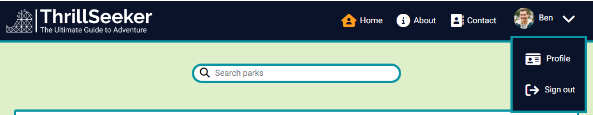
             | Pass   |
|                  |                                                                                                                                                                                  |                                                                                                                                                                                                                                                                                                                                    |                                                                                                                                                                                                                                                                                                                                      |                                                                                                                                                                                                                                                                                                                                                                                                                                                                                                             | 

Navigation3
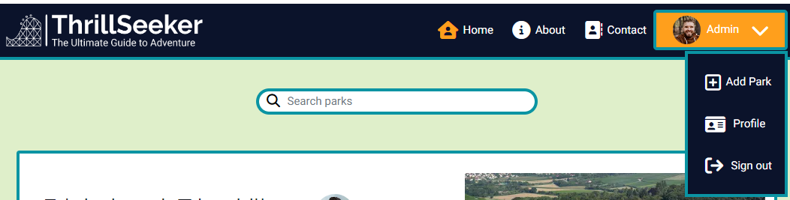
             | Pass   |
|                  |                                                                                                                                                                                  |                                                                                                                                                                                                                                                                                                                                    |                                                                                                                                                                                                                                                                                                                                      |                                                                                                                                                                                                                                                                                                                                                                                                                                                                                                             |                                                                                                                             |        |
|  Authentication  | As a user I can create an account to log in so that i can use limited functions for logged in users                                                                              | AC1: There is a registration form on the website which I can fill in. AC2: The data will be saved in the database                                                                                                                                                                                                               | The creation of a new user was tested. With valid data and with invalid data.                                                                                                                                                                                                                                                        | There is a register form on the website. This checks whether the input is valid and gives feedback if the input is not valid. If valid data is entered and the signup button is clicked, the new user is created and the user is redirected to the sigin page where he can now log in with his user data.                                                                                                                                                                                                | 

signup1
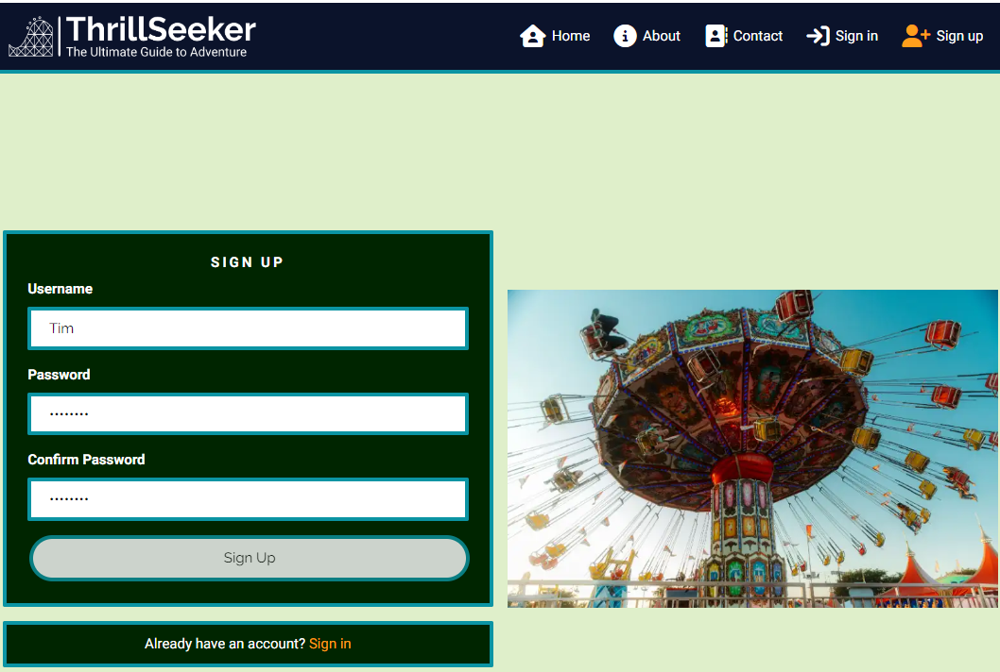
                 | Pass   |
|                  |                                                                                                                                                                                  |                                                                                                                                                                                                                                                                                                                                    |                                                                                                                                                                                                                                                                                                                                      |                                                                                                                                                                                                                                                                                                                                                                                                                                                                                                             | 

signup2
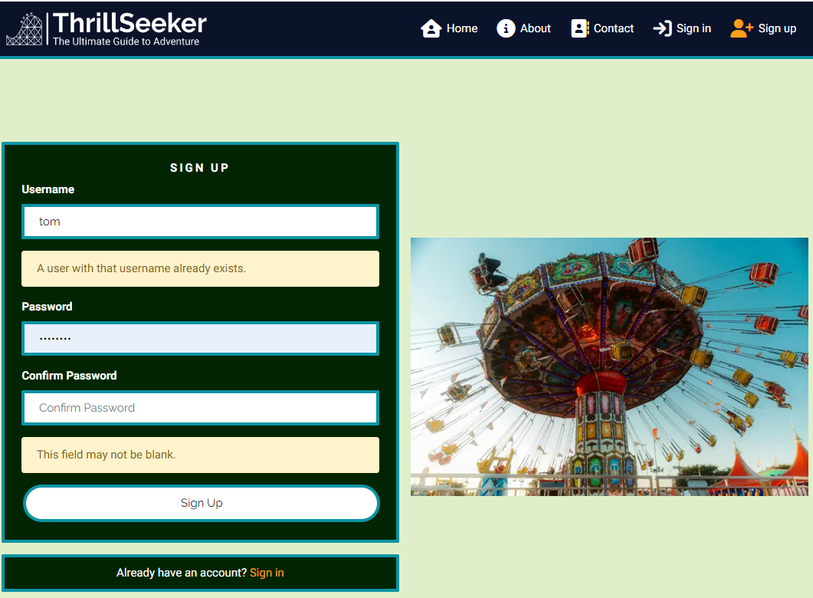
                 |        |
|  Authentication  | As a user I can log in so that I can access all features for logged in users                                                                                                     | AC1: There is a login form on the website which I can fill in. AC2: The data will be saved in the database                                                                                                                                                                                                                      | The login of the newly created user has been tested. Also tested whether it is possible to log in with invalid data                                                                                                                                                                                                                  | Logging in is not possible with invalid data. With valid data the user is logged in and avatar and name are displayed in the navbar.                                                                                                                                                                                                                                                                                                                                                                        | 

signin1
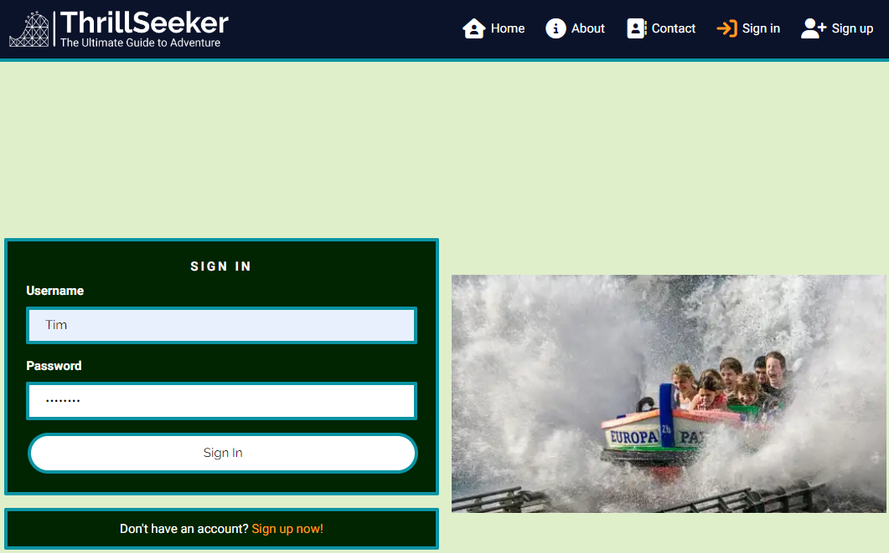
                 | Pass   |
|                  |                                                                                                                                                                                  |                                                                                                                                                                                                                                                                                                                                    |                                                                                                                                                                                                                                                                                                                                      |                                                                                                                                                                                                                                                                                                                                                                                                                                                                                                             | 

signin2
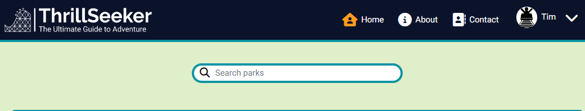
                 |        |
|                  |                                                                                                                                                                                  |                                                                                                                                                                                                                                                                                                                                    |                                                                                                                                                                                                                                                                                                                                      |                                                                                                                                                                                                                                                                                                                                                                                                                                                                                                             | 

signin3
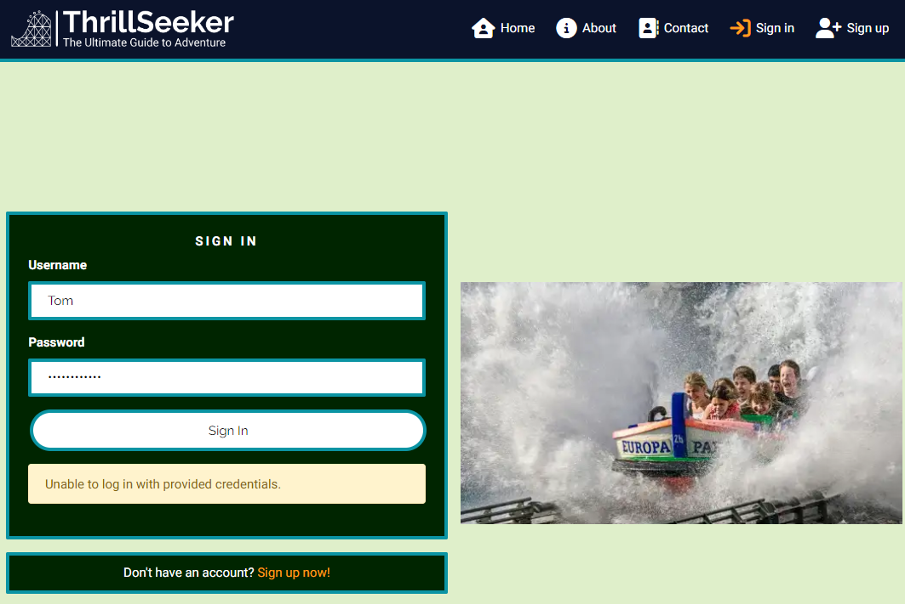
                 |        |
|                  |                                                                                                                                                                                  |                                                                                                                                                                                                                                                                                                                                    |                                                                                                                                                                                                                                                                                                                                      |                                                                                                                                                                                                                                                                                                                                                                                                                                                                                                             |                                                                                                                             |        |
| Parks overview   | As a user I can read all Park articles sorted by publication date so that I always get the latest article first                                                                  | AC1: The articles are displayed in order of creation date                                                                                                                                                                                                                                                                          | Check whether the parks are listed in the order of publication based on the date in the park review article                                                                                                                                                                                                                          | The parks are listed in order of publication so that I see the most recently created park first                                                                                                                                                                                                                                                                                                                                                                                                             | 

parks overview1
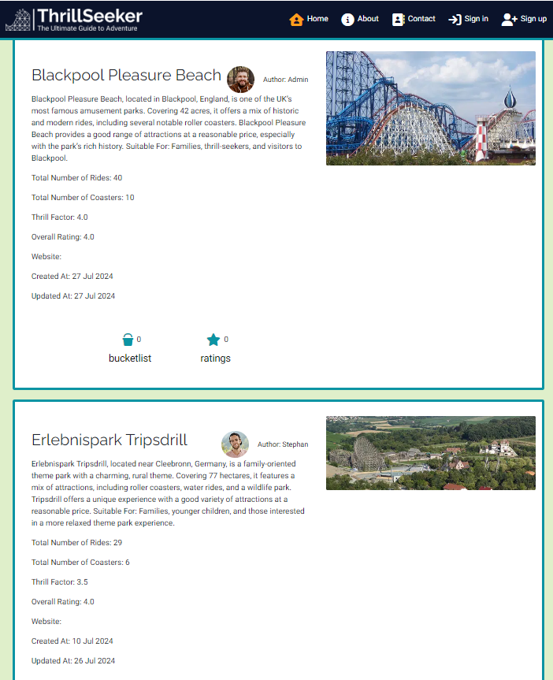
 | Pass   |
| Parks overview   | As a user, I can search for keywords so that I can find the park that interest me the most.                                                                                      | AC1: A search bar is available on the website AC2: I can enter what I am looking for.                                                                                                                                                                                                                                           | It was checked whether I can search for the planned table entries, park name, author name and for the contents of the description of the park by entering the search terms (Anna, Europa and coaster).                                                                                                                               | When anna is entered, all articles from anna should appear. if you enter europa, the park article should appear. if you enter coaster, all articles should appear where the word coaster is explicitly used in the description.                                                                                                                                                                                                                                                                       | 

parks overview2
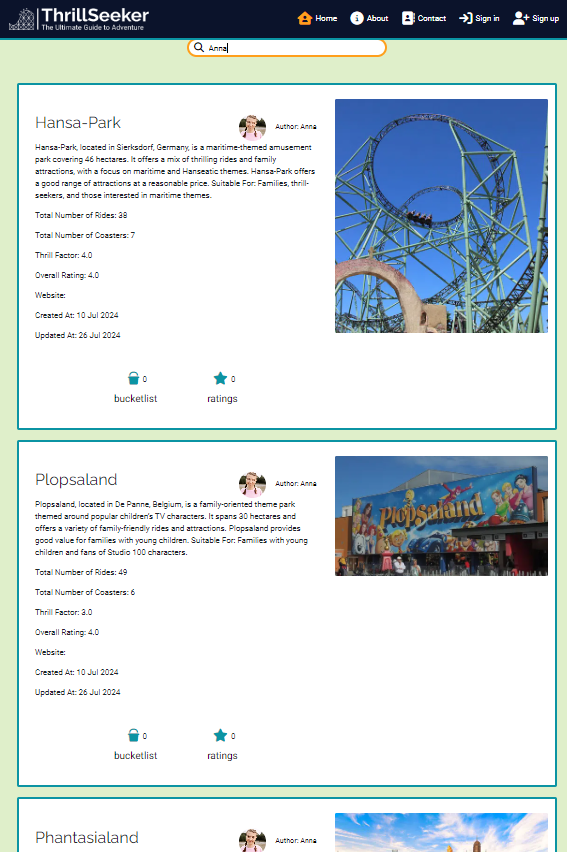
 | Pass   |
|                  |                                                                                                                                                                                  |                                                                                                                                                                                                                                                                                                                                    |                                                                                                                                                                                                                                                                                                                                      |                                                                                                                                                                                                                                                                                                                                                                                                                                                                                                             | 

parks overview3
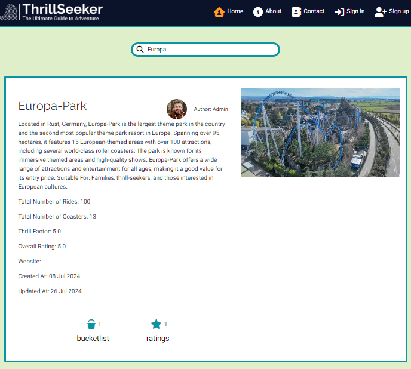
 |        |
|                  |                                                                                                                                                                                  |                                                                                                                                                                                                                                                                                                                                    |                                                                                                                                                                                                                                                                                                                                      |                                                                                                                                                                                                                                                                                                                                                                                                                                                                                                             | 

parks overview4
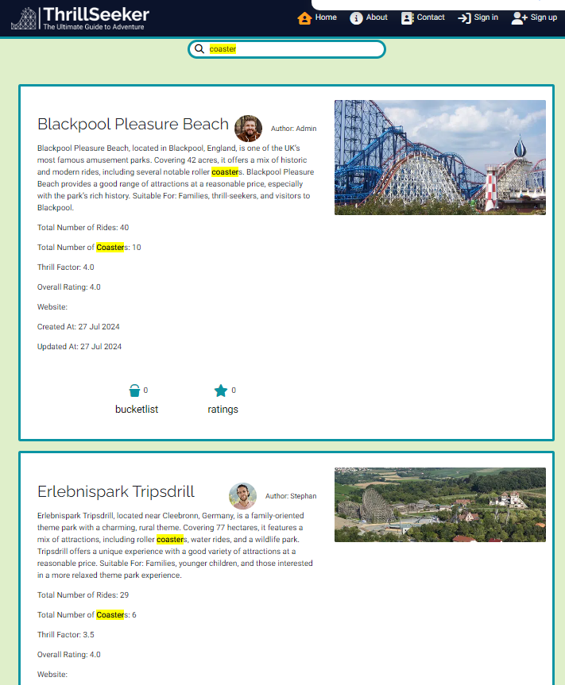
 |        |
| Parks overview   | As a user, I can see the park that have been rated and have been put in a bucketlist so that I can form a better opinion about a park and decide which one I want to visit next. | AC1: Parks have a rating counter. AC2: Parks have a bucketlist counter to the park.                                                                                                                                                                                                                                             | Check whether all parks have a bucket list and a ratings counter                                                                                                                                                                                                                                                                     | All parks have a bucketlist and a ratings counter                                                                                                                                                                                                                                                                                                                                                                                                                                                           | 

parks overview5
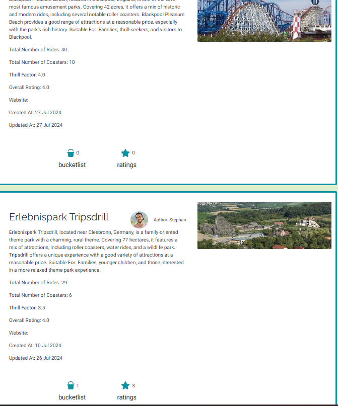
 | Pass   |
| Parks overview   | As a user, I can scroll through the articles on the website, which are automatically loaded, so I don't have to click on buttons and change pages.                               | AC1: I can scroll without clicking and without having to stop                                                                                                                                                                                                                                                                      | Scroll on the park page to see if more parks are loaded without clicking or any other action                                                                                                                                                                                                                                         | More parks are loaded without clicking or any other action when you scroll down the page                                                                                                                                                                                                                                                                                                                                                                                                                    | 

parks overview6
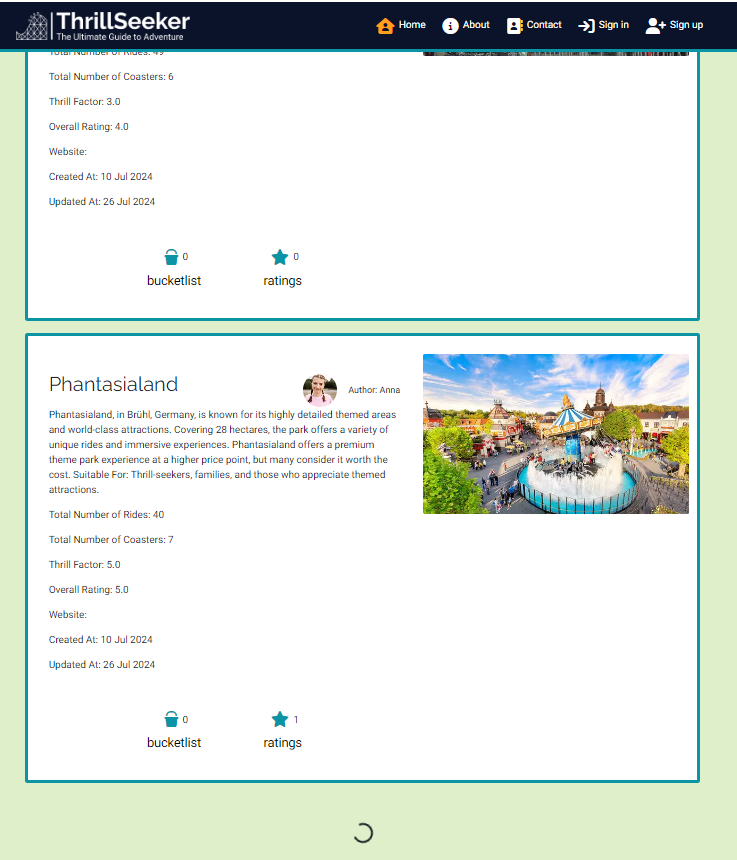
 | Pass   |
|                  |                                                                                                                                                                                  |                                                                                                                                                                                                                                                                                                                                    |                                                                                                                                                                                                                                                                                                                                      |                                                                                                                                                                                                                                                                                                                                                                                                                                                                                                             |                                                                                                                             |        |
| Park detail page | As the supersuer I can create a park article to expand the website content                                                                                                       | AC1:There is a form to fill out an create a new park with all avalable fields                                                                                                                                                                                                                                                      | The park create form was filled out with valid and non-valid data.                                                                                                                                                                                                                                                                   | The non-valid data was not accepted but errors were displayed. When valid data was entered, a new park was created with the data. After the creation, the new park detail page is loaded.                                                                                                                                                                                                                                                                                                                   | 

parks create1
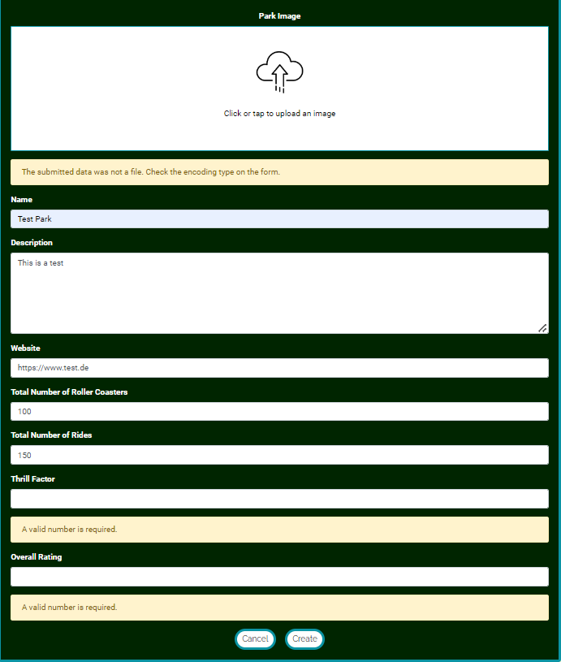
      | Pass   |
|                  |                                                                                                                                                                                  |                                                                                                                                                                                                                                                                                                                                    |                                                                                                                                                                                                                                                                                                                                      |                                                                                                                                                                                                                                                                                                                                                                                                                                                                                                             | 

parks create2
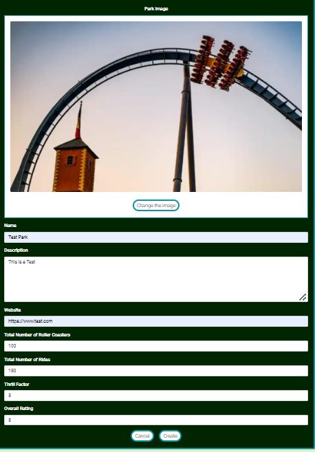
      |        |
|                  |                                                                                                                                                                                  |                                                                                                                                                                                                                                                                                                                                    |                                                                                                                                                                                                                                                                                                                                      |                                                                                                                                                                                                                                                                                                                                                                                                                                                                                                             | 

parks create3
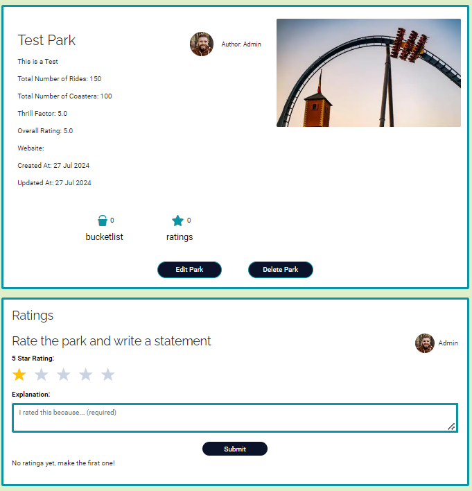
      |        |
| Park detail page | As a user, I can call up a detail view for a park so that I can read all the information about the park.                                                                         | AC1: I can access a detail view of each park via a link AC2: The page has a bootstrap styling                                                                                                                                                                                                                                   | Click on the park name and on the park picture                                                                                                                                                                                                                                                                                       | The Park Detail page opens                                                                                                                                                                                                                                                                                                                                                                                                                                                                                  | 

parks detail1
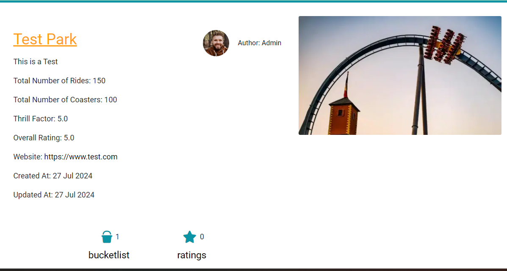
      | Pass   |
|                  |                                                                                                                                                                                  |                                                                                                                                                                                                                                                                                                                                    |                                                                                                                                                                                                                                                                                                                                      |                                                                                                                                                                                                                                                                                                                                                                                                                                                                                                             | 

parks detail2
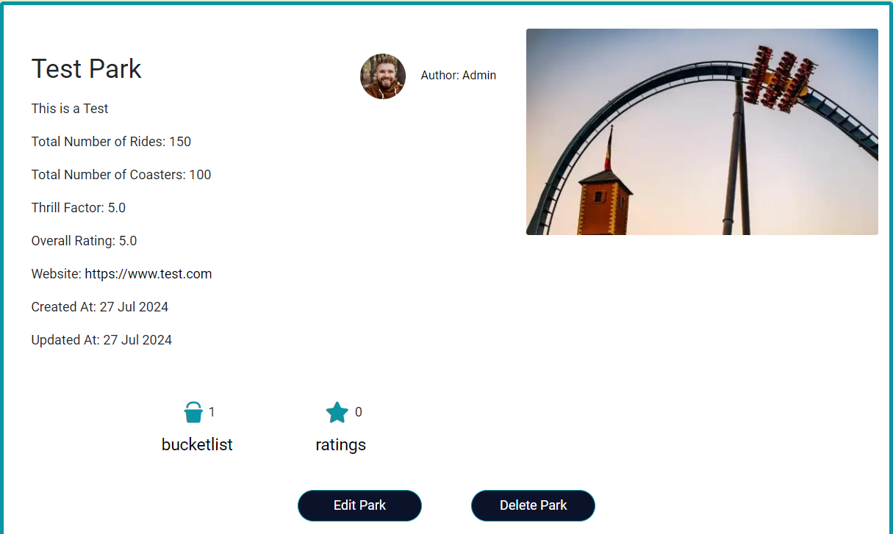
      |        |
| Park detail page | As the author of the article, I can edit the entry for the park so that it can be corrected and updated.                                                                         | AC1: I can go to an update page and update the information about a park.                                                                                                                                                                                                                                                           | As an authorised park owner, I click on edit park. The park edit page opens and then the data is changed and saved.                                                                                                                                                                                                                  | The data should be loaded. Be able to be changed and saved and then be readable when the park is set up                                                                                                                                                                                                                                                                                                                                                                                                     | 

parks update1
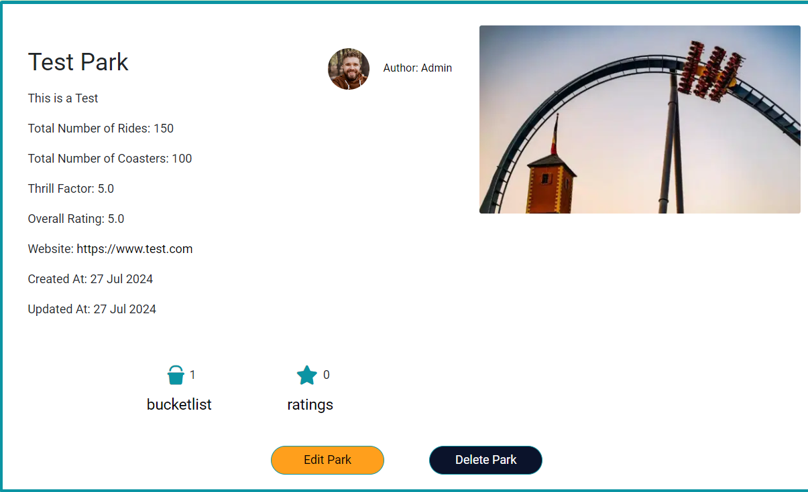
      | Pass   |
|                  |                                                                                                                                                                                  |                                                                                                                                                                                                                                                                                                                                    |                                                                                                                                                                                                                                                                                                                                      |                                                                                                                                                                                                                                                                                                                                                                                                                                                                                                             | 

parks update2
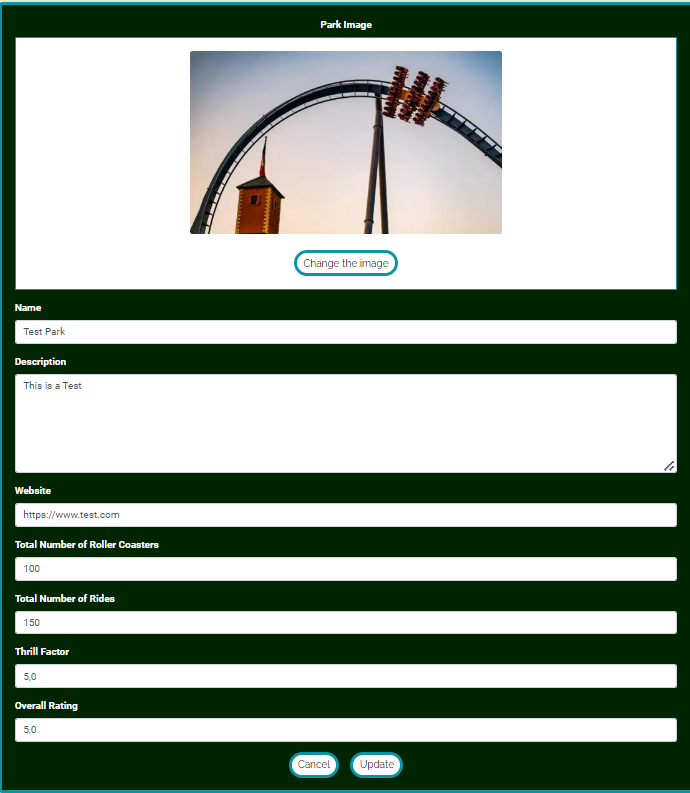
      |        |
|                  |                                                                                                                                                                                  |                                                                                                                                                                                                                                                                                                                                    |                                                                                                                                                                                                                                                                                                                                      |                                                                                                                                                                                                                                                                                                                                                                                                                                                                                                             | 

parks update3
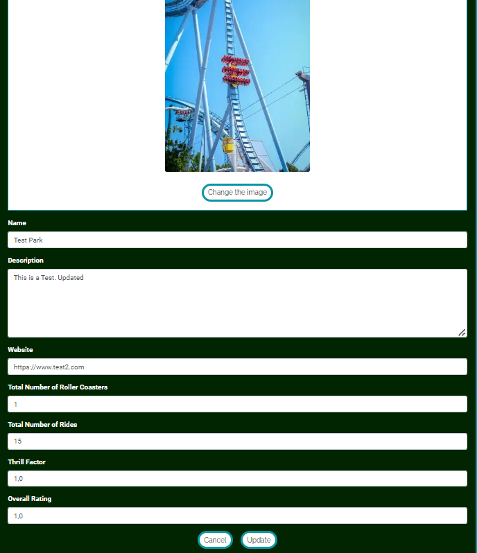
      |        |
|                  |                                                                                                                                                                                  |                                                                                                                                                                                                                                                                                                                                    |                                                                                                                                                                                                                                                                                                                                      |                                                                                                                                                                                                                                                                                                                                                                                                                                                                                                             | 

parks update4
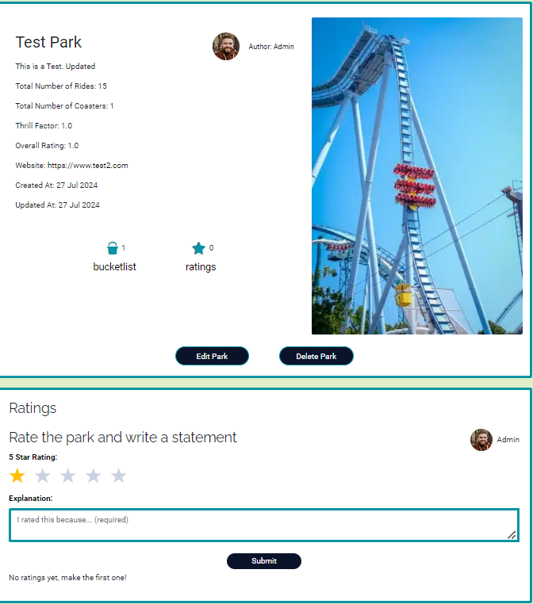
      |        |
| Park detail page | As the author of the article, I can delete the entry for the park if a park is closed and no longer exists                                                                       | AC1: The author can delete his article                                                                                                                                                                                                                                                                                             | I click on the delete park button. Then click on the delete button in the confirm delete menu.                                                                                                                                                                                                                                       | The park will be deleted and I will go to the parkspage, homepage.                                                                                                                                                                                                                                                                                                                                                                                                                                          | 

parks delete1
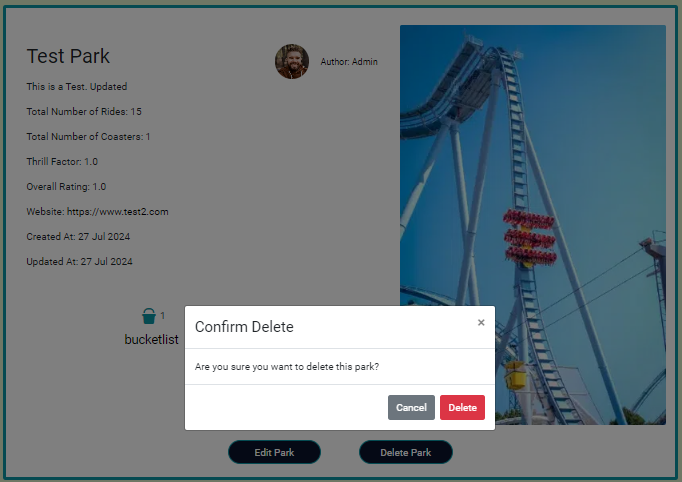
     | Pass   |
|                  |                                                                                                                                                                                  |                                                                                                                                                                                                                                                                                                                                    |                                                                                                                                                                                                                                                                                                                                      |                                                                                                                                                                                                                                                                                                                                                                                                                                                                                                             | 

parks delete2
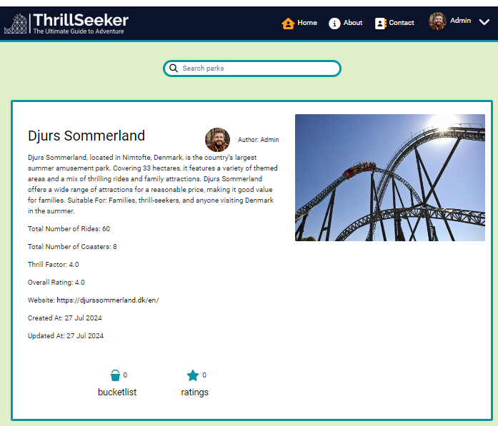
     |        |
|                  |                                                                                                                                                                                  |                                                                                                                                                                                                                                                                                                                                    |                                                                                                                                                                                                                                                                                                                                      |                                                                                                                                                                                                                                                                                                                                                                                                                                                                                                             |                                                                                                                             |        |
| Bucketlist       | As a logged in user I can put a park on my bucket list so that I have a list of parks I still want to visit                                                                      | AC1: I can add a park to my bucket list                                                                                                                                                                                                                                                                                            | I click on a bucket icon under a park whose park is not yet in the bucket list of the logged-in user                                                                                                                                                                                                                                 | If the park is not already on the bucketlist, the bucketlist counter is increased by one. In addition, the associated park is added to the bucket list on the profile page of the logged-in user                                                                                                                                                                                                                                                                                                            | 

bucketlist1
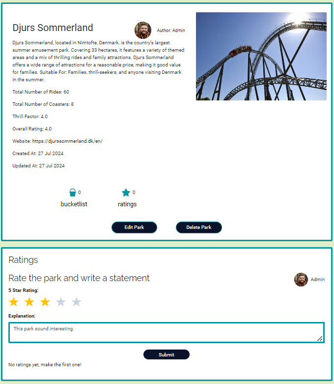
         | Pass   |
|                  |                                                                                                                                                                                  |                                                                                                                                                                                                                                                                                                                                    |                                                                                                                                                                                                                                                                                                                                      |                                                                                                                                                                                                                                                                                                                                                                                                                                                                                                             | 

bucketlist2
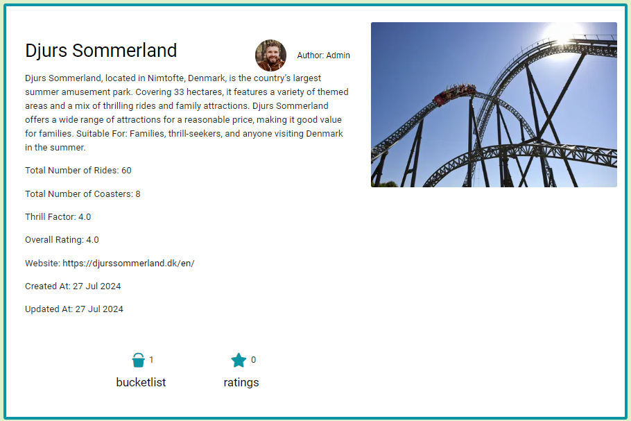
         |        |
|                  |                                                                                                                                                                                  |                                                                                                                                                                                                                                                                                                                                    |                                                                                                                                                                                                                                                                                                                                      |                                                                                                                                                                                                                                                                                                                                                                                                                                                                                                             | 

bucketlist3

         |        |
| Bucketlist       | As a logged in user I can delete a park from my bucket list so that I can update my list if i change my mind                                                                     | AC1: I can delete a park from my bucket list                                                                                                                                                                                                                                                                                       | I click on a bucket icon under a park whose park is already on the bucket list of the logged-in user                                                                                                                                                                                                                                 | If the park is already on the bucket list, the bucket list counter is reduced by one. In addition, the corresponding park is deleted from the bucket list on the logged-in user's profile page.                                                                                                                                                                                                                                                                                                             | 

bucketlist4
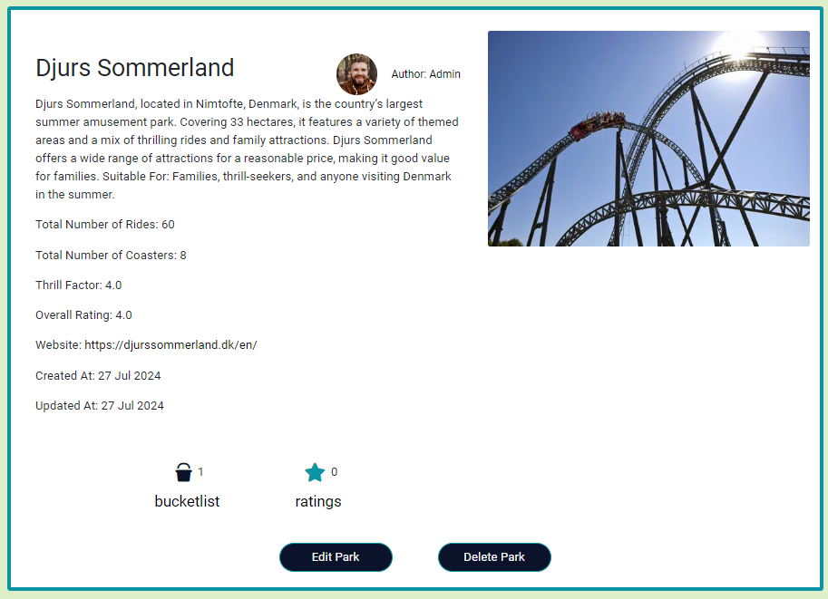
         | Pass   |
|                  |                                                                                                                                                                                  |                                                                                                                                                                                                                                                                                                                                    |                                                                                                                                                                                                                                                                                                                                      |                                                                                                                                                                                                                                                                                                                                                                                                                                                                                                             | 

bucketlist5
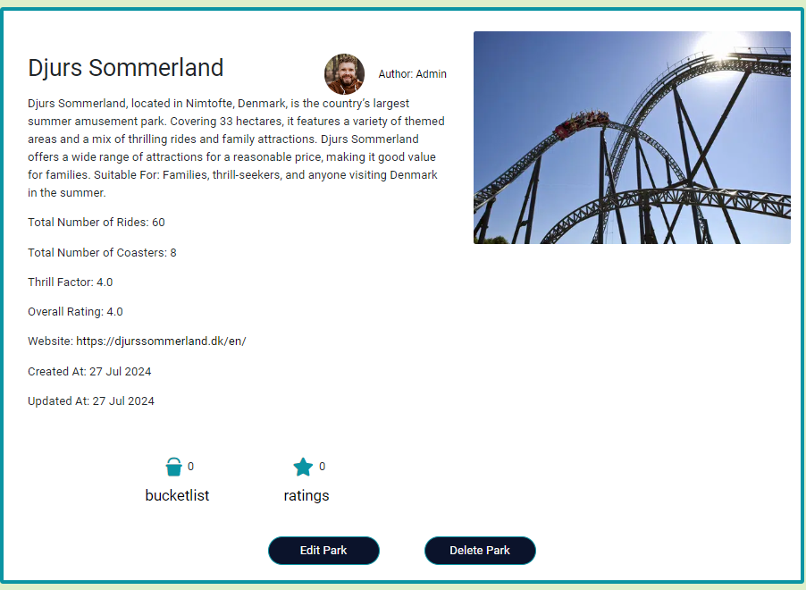
         |        |
|                  |                                                                                                                                                                                  |                                                                                                                                                                                                                                                                                                                                    |                                                                                                                                                                                                                                                                                                                                      |                                                                                                                                                                                                                                                                                                                                                                                                                                                                                                             | 

bucketlist6
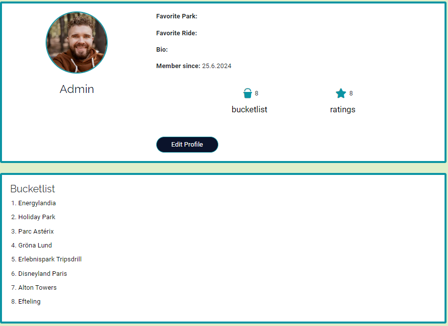
         |        |
|                  |                                                                                                                                                                                  |                                                                                                                                                                                                                                                                                                                                    |                                                                                                                                                                                                                                                                                                                                      |                                                                                                                                                                                                                                                                                                                                                                                                                                                                                                             |                                                                                                                             |        |
| Rating a park    | As a logged in user, I can rate a park and give my opinion in a text field so that I can share my opinion and experience with others.                                            | AC1: I can give a rating when I am logged in. AC2: I can write a text in a text field AC3: I can see when the rating was last edited or created.                                                                                                                                                                             | As a logged-in user, I scroll down to the rating authorisation on a parking parts page. If I have not yet submitted a rating, the rating create form is visible. I select a number of stars and write a description and click submit. I also test what happens if the data is not valid, i.e. no explanation has been entered.       | If the data is not valid, a message appears. If the entries are ok, a rating is created and the rating count is increased by one.                                                                                                                                                                                                                                                                                                                                                                           | 

ratings1
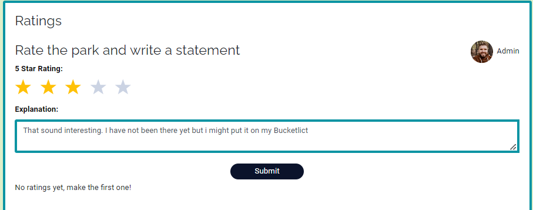
                | Pass   |
|                  |                                                                                                                                                                                  |                                                                                                                                                                                                                                                                                                                                    |                                                                                                                                                                                                                                                                                                                                      |                                                                                                                                                                                                                                                                                                                                                                                                                                                                                                             | 

ratings2
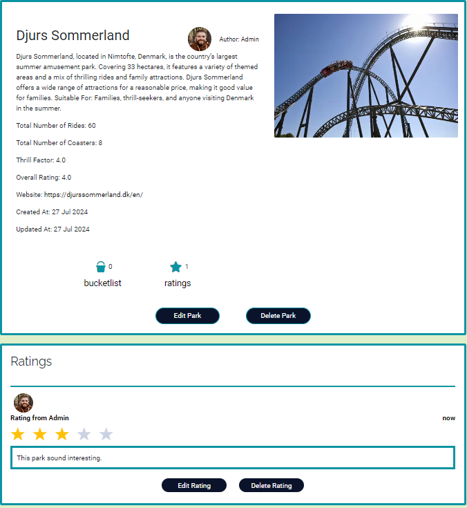
                |        |
|                  |                                                                                                                                                                                  |                                                                                                                                                                                                                                                                                                                                    |                                                                                                                                                                                                                                                                                                                                      |                                                                                                                                                                                                                                                                                                                                                                                                                                                                                                             | 

ratings3

                |        |
| Rating a park    | As a logged in user, I can update my created rating so that I can change my mind and share my new opionen                                                                        | AC1: I can update my rating                                                                                                                                                                                                                                                                                                        | I click on edit rating. Then I can change the rating and save it again. If I click on cancel, I cancel the process.                                                                                                                                                                                                                  | I can click on edit rating to change the rating, click on cancel to cancel the process and click on save to save the changes                                                                                                                                                                                                                                                                                                                                                                                | 

ratings4
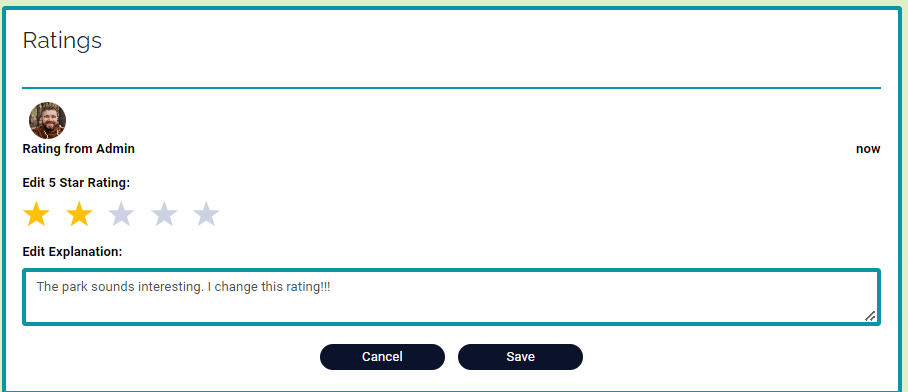
                | Pass   |
|                  |                                                                                                                                                                                  |                                                                                                                                                                                                                                                                                                                                    |                                                                                                                                                                                                                                                                                                                                      |                                                                                                                                                                                                                                                                                                                                                                                                                                                                                                             | 

ratings5
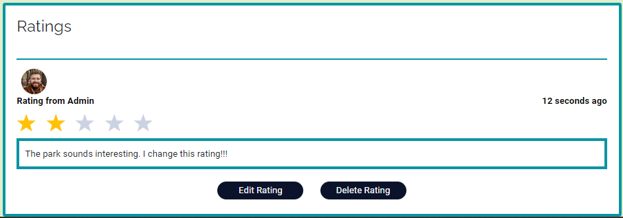
                |        |
| Rating a park    | As a logged in user, I can delite my created rating so the rating is not visible anymore                                                                                         | AC1: I can delete my rating                                                                                                                                                                                                                                                                                                        | I click on the delete button under my rating. I then confirm the deletion in the delete rating form that appears .                                                                                                                                                                                                                   | The rating is deleted and the rating create from appears again under the park because I have not yet created a rating for this park.                                                                                                                                                                                                                                                                                                                                                                        | 

ratings6
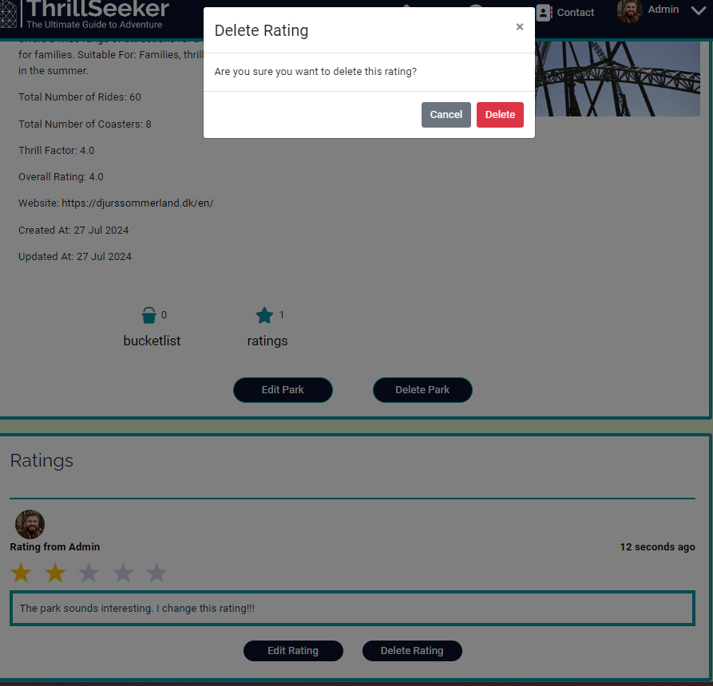
                | Pass   |
|                  |                                                                                                                                                                                  |                                                                                                                                                                                                                                                                                                                                    |                                                                                                                                                                                                                                                                                                                                      |                                                                                                                                                                                                                                                                                                                                                                                                                                                                                                             | 

ratings7
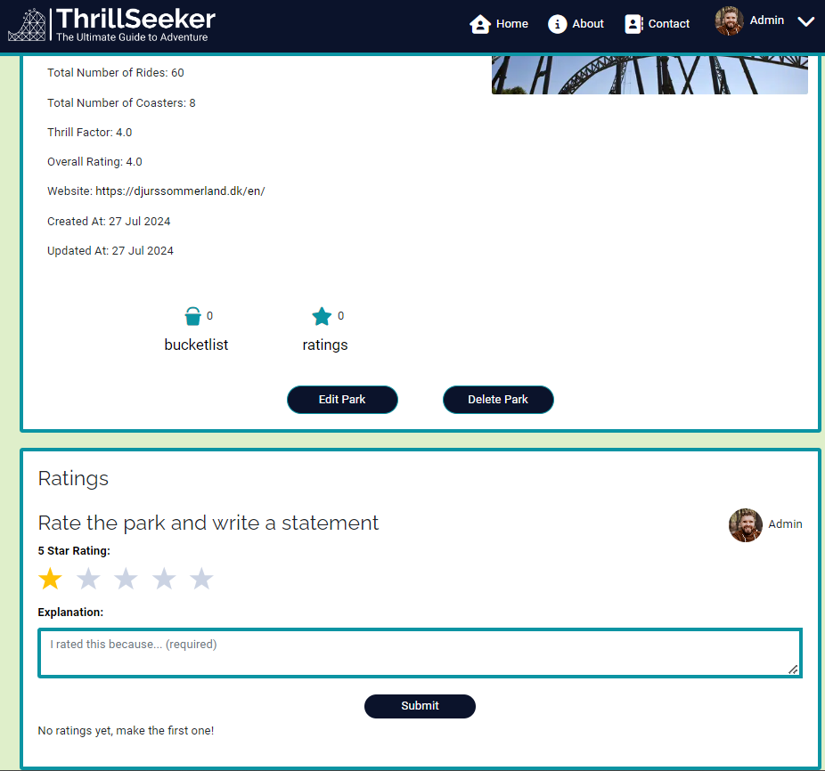
                |        |
|                  |                                                                                                                                                                                  |                                                                                                                                                                                                                                                                                                                                    |                                                                                                                                                                                                                                                                                                                                      |                                                                                                                                                                                                                                                                                                                                                                                                                                                                                                             |                                                                                                                             | Pass   |
| About page       | As a users I can read on the about page what the purpose of the website is so that I am informed whether the site fits my requirements                                           | AC1: About page with a bootstrap styling is accessible to everyone and can be read.                                                                                                                                                                                                                                                | I open the about page via the navbar.                                                                                                                                                                                                                                                                                                | The navbar opens and I can read the relevant data.                                                                                                                                                                                                                                                                                                                                                                                                                                                          | 

about
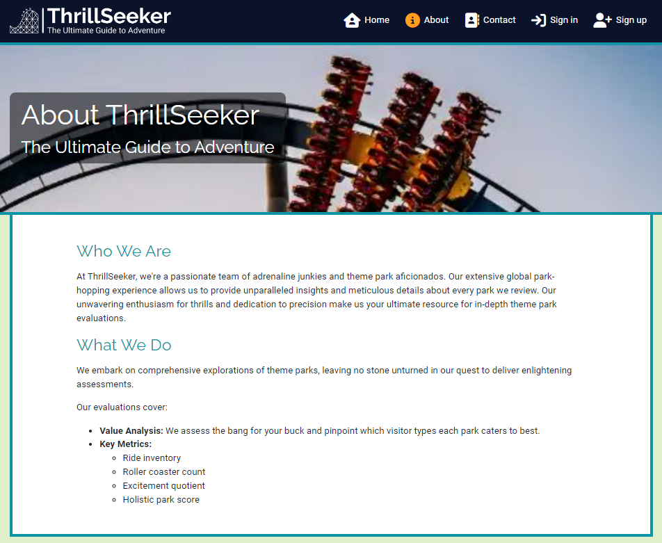
                     | Pass   |
|                  |                                                                                                                                                                                  |                                                                                                                                                                                                                                                                                                                                    |                                                                                                                                                                                                                                                                                                                                      |                                                                                                                                                                                                                                                                                                                                                                                                                                                                                                             |                                                                                                                             |        |
| Contact form     | All users can send a message to the admin  (saved in the Database)  via the contract form so that I can give a feeedback and send my wishes for the next park article            | AC1: Contact Form page with a bootstrap styling is accessible to everyone and can be filled out and submitted. AC2: I get feedback when I have submitted the form.                                                                                                                                                              | I fill out the contact form and send it.                                                                                                                                                                                                                                                                                             | I get this displayed if the data is not valid. I can send valid data and then receive feedback. Then I will see the transmitted data in the "Review your transmitted data (Unfortunately, the subject field is not displayed correctly in the chrome browser.)                                                                                                                                                                                                                                              | 

contact_form1

     | Pass   |
|                  |                                                                                                                                                                                  |                                                                                                                                                                                                                                                                                                                                    |                                                                                                                                                                                                                                                                                                                                      |                                                                                                                                                                                                                                                                                                                                                                                                                                                                                                             | 

contact_form2
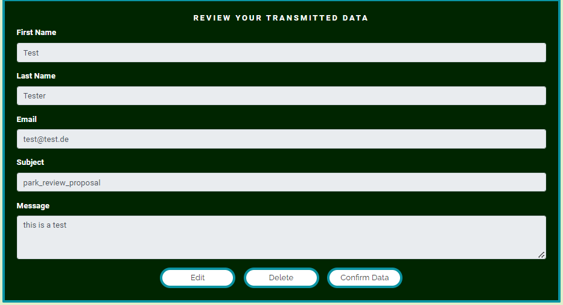
     |        |
| Contact form     | As a user, I can view the sent data again, update it and delete it before it is saved permanently.                                                                               | AC1. The user is taken to a page where the data he has entered is displayed AC2: The user can update the data from there on another page. AC3: The user can after saving, view the data again. AC4: The usercan delete the data. AC5: The user can leave via confirm data the page and then no longer change the data. | First I click on edit and change the form data and save it. Then I click on delete and confirm this in the next menu. I check whether data has been saved in the database. Afterwards I will get this again with a new message and click on confirm data. now data should be visible in the database in the backend for a superuser. | When I click on edit, I can edit the sent data and save it again. If the data is not valid, this is displayed. If I click on delete, confirm delete from appears. If I confirm with delete, the data is deleted and I am taken to the homepage. If I click on confirm data, I am also redirected to the homepage and I get a confirmation that the data has been saved. Now I can no longer access it. Only data in the database is visible to the superuser if the data has not been deleted via the menu. | 

contact_form3
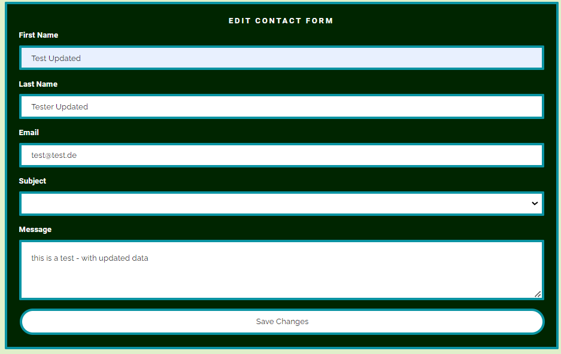
     | Pass   |
|                  |                                                                                                                                                                                  |                                                                                                                                                                                                                                                                                                                                    |                                                                                                                                                                                                                                                                                                                                      |                                                                                                                                                                                                                                                                                                                                                                                                                                                                                                             | 

contact_form4
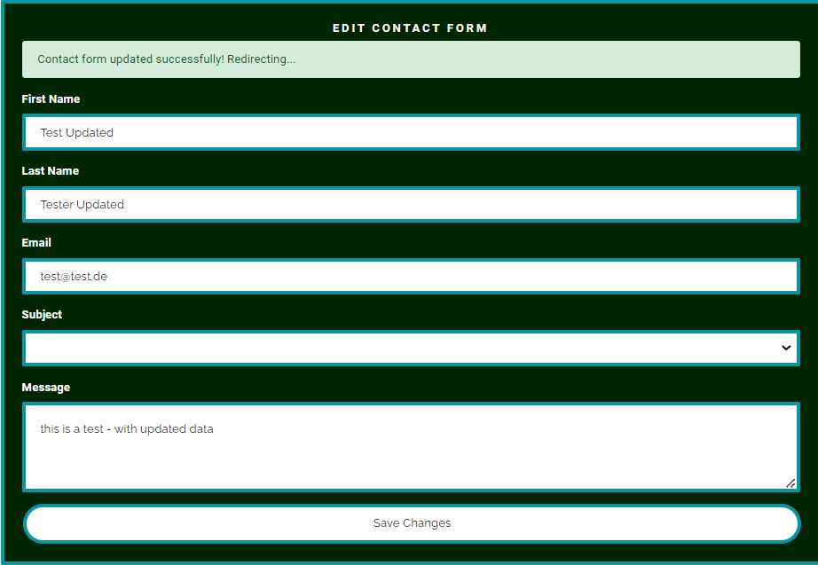
     |        |
|                  |                                                                                                                                                                                  |                                                                                                                                                                                                                                                                                                                                    |                                                                                                                                                                                                                                                                                                                                      |                                                                                                                                                                                                                                                                                                                                                                                                                                                                                                             | 

contact_form5
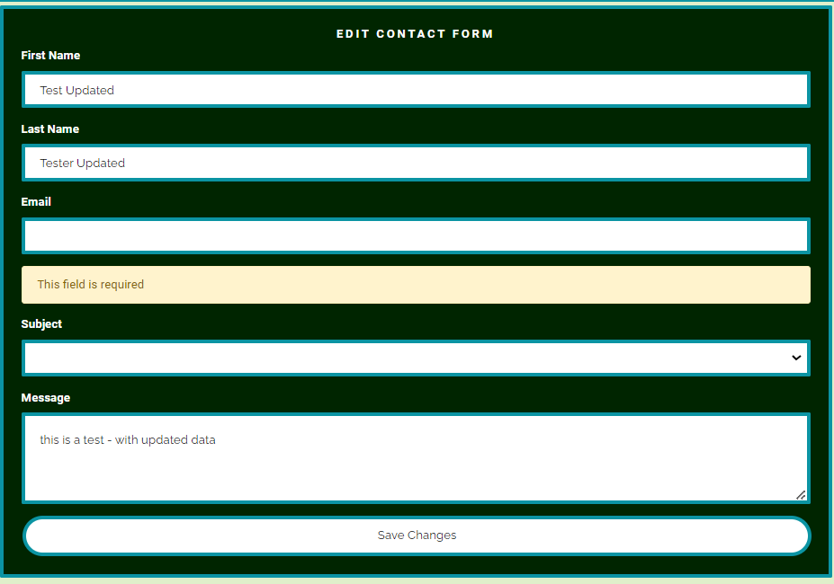
     |        |
|                  |                                                                                                                                                                                  |                                                                                                                                                                                                                                                                                                                                    |                                                                                                                                                                                                                                                                                                                                      |                                                                                                                                                                                                                                                                                                                                                                                                                                                                                                             | 

contact_form6
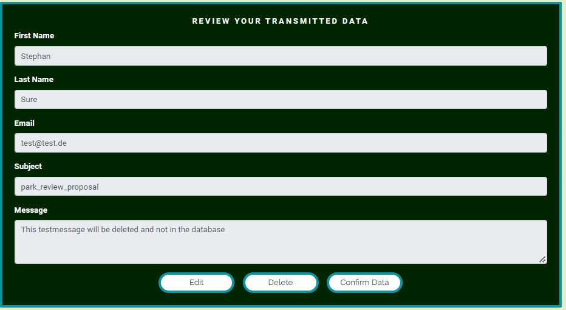
     |        |
|                  |                                                                                                                                                                                  |                                                                                                                                                                                                                                                                                                                                    |                                                                                                                                                                                                                                                                                                                                      |                                                                                                                                                                                                                                                                                                                                                                                                                                                                                                             | 

contact_form7
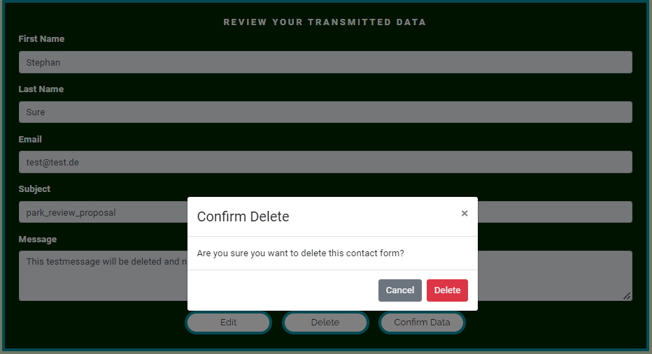
     |        |
|                  |                                                                                                                                                                                  |                                                                                                                                                                                                                                                                                                                                    |                                                                                                                                                                                                                                                                                                                                      |                                                                                                                                                                                                                                                                                                                                                                                                                                                                                                             | 

contact_form8
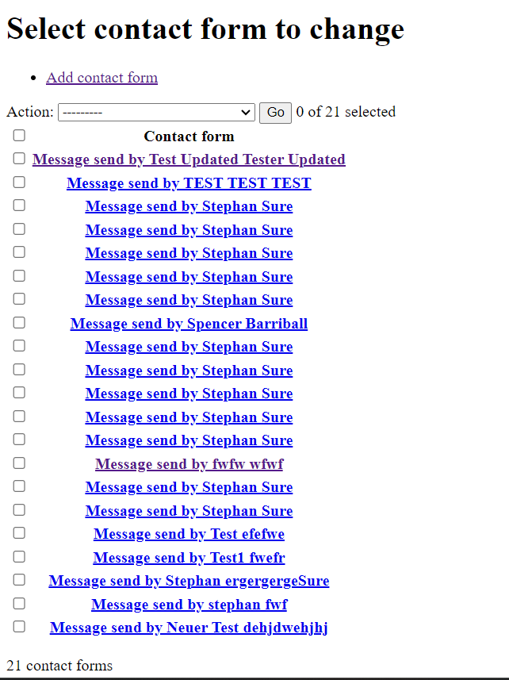
     |        |
|                  |                                                                                                                                                                                  |                                                                                                                                                                                                                                                                                                                                    |                                                                                                                                                                                                                                                                                                                                      |                                                                                                                                                                                                                                                                                                                                                                                                                                                                                                             | 

contact_form9
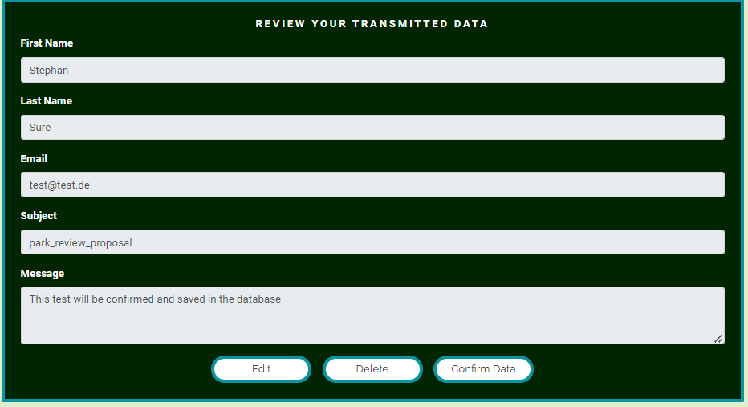
     |        |
|                  |                                                                                                                                                                                  |                                                                                                                                                                                                                                                                                                                                    |                                                                                                                                                                                                                                                                                                                                      |                                                                                                                                                                                                                                                                                                                                                                                                                                                                                                             | 

contact_form10
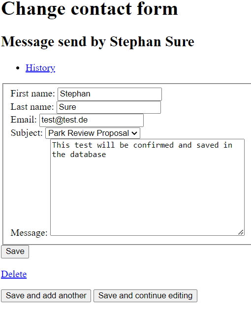
   |        |
|                  |                                                                                                                                                                                  |                                                                                                                                                                                                                                                                                                                                    |                                                                                                                                                                                                                                                                                                                                      |                                                                                                                                                                                                                                                                                                                                                                                                                                                                                                             |                                                                                                                             |        |
| User Profile     | As a user i can go to other user profiles so that I can find more informations about the specific user                                                                           | AC1: I can go to userprofiles via links in ratings and park artikel                                                                                                                                                                                                                                                                | I click on the username, avatar of a user in the ratings section or in a park artikel on the website.                                                                                                                                                                                                                                | I landed on the profile page of the user whose avatar picture or username  I clicked on                                                                                                                                                                                                                                                                                                                                                                                                                     | 

profile1
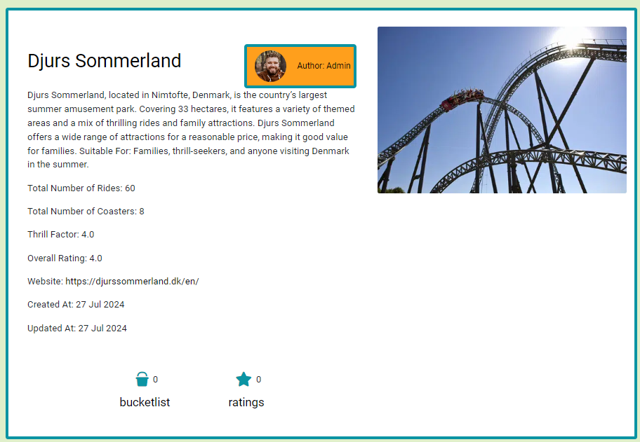
               | Pass   |
|                  |                                                                                                                                                                                  |                                                                                                                                                                                                                                                                                                                                    |                                                                                                                                                                                                                                                                                                                                      |                                                                                                                                                                                                                                                                                                                                                                                                                                                                                                             | 

profile2
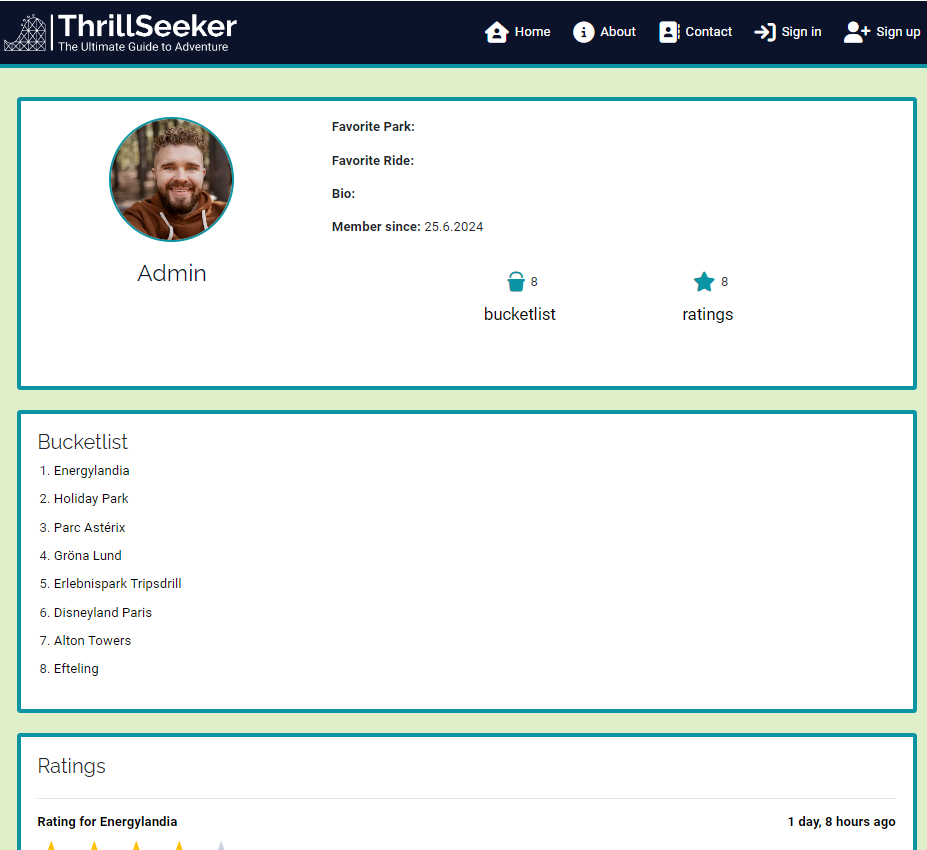
               |        |
|                  |                                                                                                                                                                                  |                                                                                                                                                                                                                                                                                                                                    |                                                                                                                                                                                                                                                                                                                                      |                                                                                                                                                                                                                                                                                                                                                                                                                                                                                                             | 

profile3
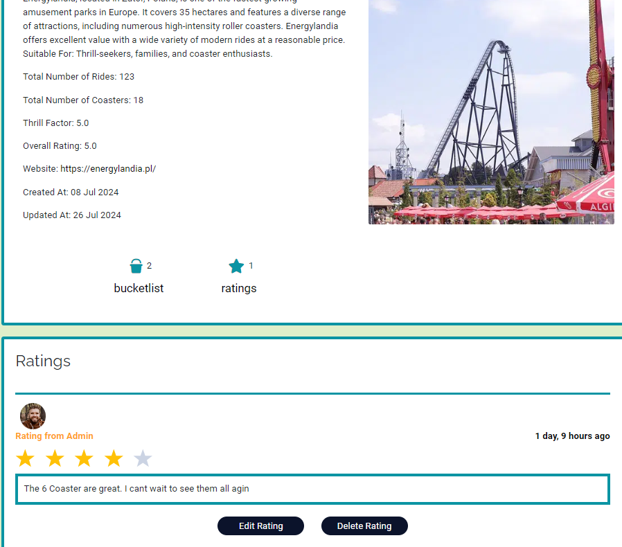
               |        |
|                  |                                                                                                                                                                                  |                                                                                                                                                                                                                                                                                                                                    |                                                                                                                                                                                                                                                                                                                                      |                                                                                                                                                                                                                                                                                                                                                                                                                                                                                                             | 

profile4
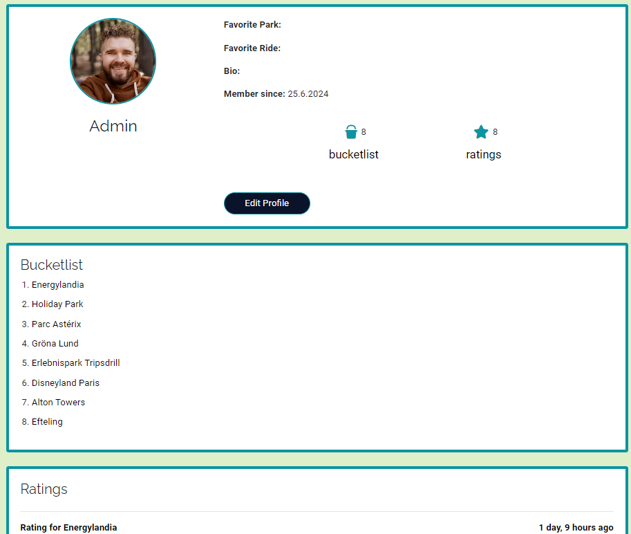
               |        |
| User Profile     | As a user, I can view all ratings and bucketlist items of a particular user when I am on their profile, so that I can read more from that person                                 | AC1: All ratings and bucketlist items that belong to the user profile are listed under the profile. AC2: The listed points are styled with bootstrap                                                                                                                                                                            | I open the user profile of a user.                                                                                                                                                                                                                                                                                                   | An the profile you can see the bucektlist and the rating of the user to whom the profile belongs                                                                                                                                                                                                                                                                                                                                                                                                            | 

profile5
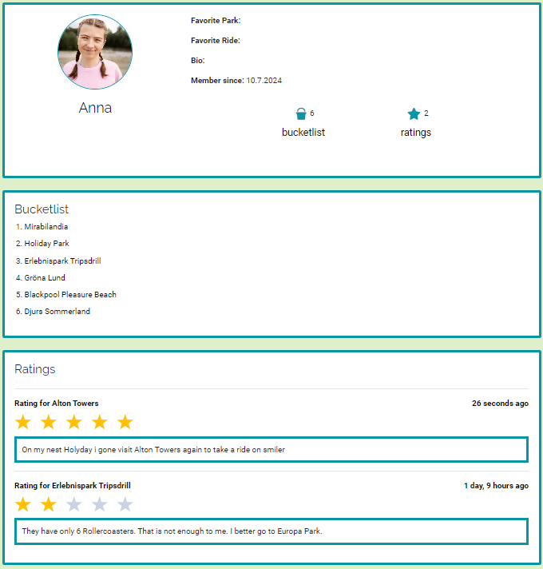
               | Pass   |
| User Profile     | As a logged in user, I can update my user profile so my details are up to date                                                                                                   | AC1: I can update a user profile                                                                                                                                                                                                                                                                                                   | I log in and go to my user profile. Then I click on Edit Profile. The existing data is displayed. I change this and save it again                                                                                                                                                                                                    | After I click on edit, the existing data loads. I can edit and save this data. The updated ürpfil is displayed.                                                                                                                                                                                                                                                                                                                                                                                             | 

profile6

               | Pass   |
|                  |                                                                                                                                                                                  |                                                                                                                                                                                                                                                                                                                                    |                                                                                                                                                                                                                                                                                                                                      |                                                                                                                                                                                                                                                                                                                                                                                                                                                                                                             | 

profile7
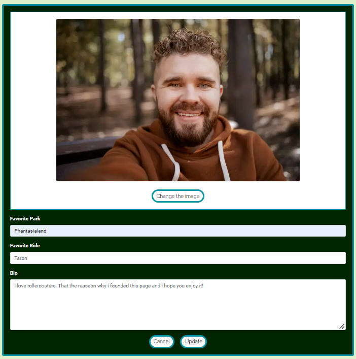
               |        |
|                  |                                                                                                                                                                                  |                                                                                                                                                                                                                                                                                                                                    |                                                                                                                                                                                                                                                                                                                                      |                                                                                                                                                                                                                                                                                                                                                                                                                                                                                                             | 

profile8
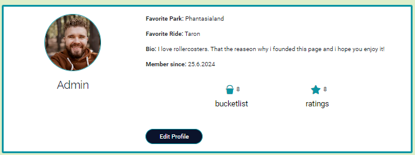
               |        |