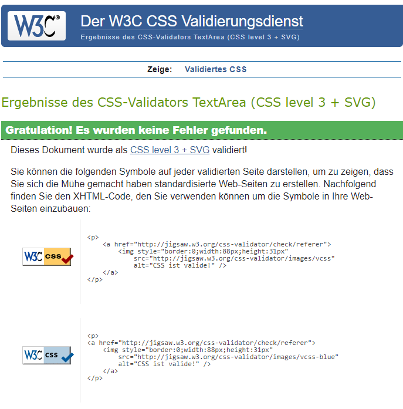

# Thrill Seeker Frontend Testing

The testing.md file provides an overview of all tests that have been carried out specifically with the Thrill Seeker frontend.   
Return back to the [README.md](README.md) file.

## Contents
- [Code Validation](#code-validation)
    * [HTML Validation](#html-validation)
    * [CSS Validation](#css-validation)
    * [JSX Validation](#javascript-validation)
- [Accessibility](#accessibility)

- [Lighthouse](#lighthouse)
- [Wave Accessibility Evaluation](#wave-accessibility-evaluation)
- [Manual Testing](#manual-testing)
- [User Input/Form Validation](#user-inputform-validation)
- [Browser Compatibility](#browser-compatibility)
- [Toastify Messages Implementation Testing](#toastify-messages-implementation-testing)
- [Responsiveness](#responsiveness)
- [Automated Testing](#automated-testing)
- [Tools Used](#tools-used)
- [Running Tests](#running-tests)
- [Bugs](#bugs)
- [Solved Bugs](#solved-bugs)
- [Known Bugs](#known-bugs)
- [Unknown Bugs](#unknown-bugs)

## Code Validation
The code for the Thrill theekers website was validated using common tools to ensure that it complies with current development standards and conventions. This testing contributes to the reliable functioning of the project.

### HTML Validation
The validation of the HTML code was done with the [W3C Markup Validator](https://validator.w3.org/).  
The html code passed the validation with usw of filter which remove issues related to the React.The settings can be seen in the screenshot. 

| Tested File | Test Result Screenshot                                                                                                                   | Result          |
| ----------- | ---------------------------------------------------------------------------------------------------------------------------------------- | --------------- |
| index.html  | 

W3C Markup Validation 

 | Pass, No errors |

### CSS Validation
The validation of the CSS code was done with the [W3C MCSS Validator](https://jigsaw.w3.org/css-validator/)  
The following css files have been tested with the W3C CSS Validator by copying the code directly into the validator. No errors occurred

| Tested File                     | Test Result Screenshot                                                                                                                              | Result          |
| ------------------------------- | --------------------------------------------------------------------------------------------------------------------------------------------------- | --------------- |
| index.css                       | 

 index.css 

                        | Pass, No errors |
| App.module.css                  | 

 App.module.css 

                   | Pass, No errors |
| About.module.css                | 

 About.module.css 

                 | Pass, No errors |
| Asset.module.css                | 

 Asset.module.css 

                 | Pass, No errors |
| Avatar.module.css               | 

 Avatar.module.css 

                | Pass, No errors |
| Button.module.css               | 

 Button.module.css

                 | Pass, No errors |
| NavBar.module.css               | 

 NavBar.module.css 

                | Pass, No errors |
| NotFound.module.css             | 

 NotFound.module.css

               | Pass, No errors |
| Park.module.css                 | 

 Park.module.css 

                  | Pass, No errors |
| ParkAddEditForm.module.css      | 

 ParkAddEditForm.module.css 

      | Pass, No errors |
| ParkPage.module.css             | 

 ParkPage.module.css 

             | Pass, No errors |
| ParksPage.module.css            | 

 ParksPage.module.css 

            | Pass, No errors |
| ProfilesEditForm.module.css     | 

 ProfilesEditForm.module.css 

     | Pass, No errors |
| ProfilesPage.module.css         | 

 ProfilesPage.module.css 

         | Pass, No errors |
| Rating.module.css               | 

 ProfilesPage.module.css 

         | Pass, No errors |
| RatingCreateEditForm.module.css | 

 RatingCreateEditForm.module.css 

 | Pass, No errors |
| SignInUpForm.module.css         | 

 SignInUpForm.module.css

          | Pass, No errors |

### JSX Validation
The validation of the JSX code was done with the [ESLint](https://eslint.org/)  
To check the code with ESLint, "npx eslint" was executed in the terminal. As expected, there is no fedback from the tool. This means that the code does not contain any errors and meets the requirements of eslint.

| Test Result Screenshot                                                                                                            | Result          |
| --------------------------------------------------------------------------------------------------------------------------------- | --------------- |
| 

W3C Markup Validation 

 | Pass, No errors |

## Accessibility
The Wave tool was used to test the accessibility of the ThrillTheeker website. WAVE stands for Web Accessibility Evaluation Tool and helps to identify potential accessibility issues and provides guidance for improvement.  
- 11 errors were detected during testing. 10 of them were due to the star icon having an empty link. I have removed these links. So all errors could be fixed.
- 1 error was due to the fact that the search bar had no form lable. Here I added a live to fix this error. 

In addition, there were 4 errors on the concat create and conatct update form and 7 each on the park create and park update form due to missing lables
These were fixed by adding lables.

The ratings create and update form had a missing form lable and also an empty label.
Here, too, lables were added and a content was added. 

In addition, after logging in there were still contrast errors displayed on the button for deleting and editing ratings. 
These were eliminated by changing the button color

A contrast error, due to too little contrast between test and background was displayed on the searchbar. I had changed the font to black with a white background, which should be very good. Nevertheless, the error persists. This is not comprehensible. The placeholder font is lighter but it should not be black otherwise there is no difference between placeholder and normal font. I don't see a problem here in contrast, so no further change attempt was made
