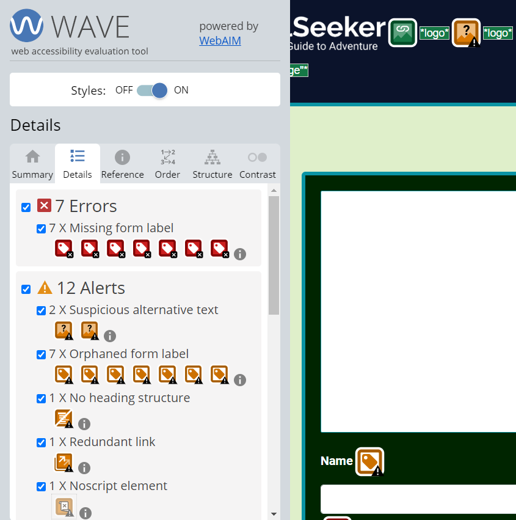
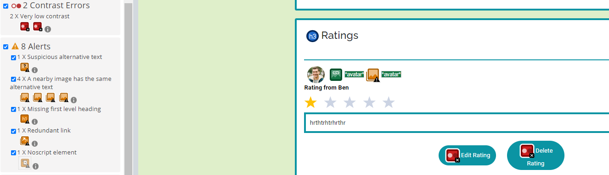
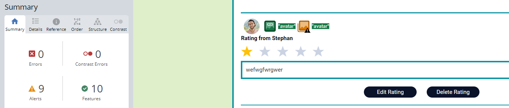

# Thrill Seeker Frontend Testing

The testing.md file provides an overview of all tests that have been carried out specifically with the Thrill Seeker frontend.   
Return back to the [README.md](README.md) file.

## Contents
- [Code Validation](#code-validation)
    * [HTML Validation](#html-validation)
    * [CSS Validation](#css-validation)
    * [JSX Validation](#javascript-validation)
- [Accessibility](#accessibility)
- [Performance](#performance)
    * [Google Lighthouse ](#google-lighthouse)
    * [Devices and Browser Compability](#devices-and-browser-compability)

- [Manual Testing](#manual-testing)
- [User Input/Form Validation](#user-inputform-validation)
- [Browser Compatibility](#browser-compatibility)
- [Toastify Messages Implementation Testing](#toastify-messages-implementation-testing)
- [Responsiveness](#responsiveness)
- [Automated Testing](#automated-testing)
- [Tools Used](#tools-used)
- [Running Tests](#running-tests)
- [Bugs](#bugs)
- [Solved Bugs](#solved-bugs)
- [Known Bugs](#known-bugs)
- [Unknown Bugs](#unknown-bugs)

## Code Validation
The code for the Thrill theekers website was validated using common tools to ensure that it complies with current development standards and conventions. This testing contributes to the reliable functioning of the project.

### HTML Validation
The validation of the HTML code was done with the [W3C Markup Validator](https://validator.w3.org/).  
The html code passed the validation with usw of filter which remove issues related to the React.The settings can be seen in the screenshot. 

| Tested File | Test Result Screenshot                                                                                                                   | Result          |
| ----------- | ---------------------------------------------------------------------------------------------------------------------------------------- | --------------- |
| index.html  | 

W3C Markup Validation 

 | Pass, No errors |

### CSS Validation
The validation of the CSS code was done with the [W3C MCSS Validator](https://jigsaw.w3.org/css-validator/)  
The following css files have been tested with the W3C CSS Validator by copying the code directly into the validator. No errors occurred

| Tested File                     | Test Result Screenshot                                                                                                                              | Result          |
| ------------------------------- | --------------------------------------------------------------------------------------------------------------------------------------------------- | --------------- |
| index.css                       | 

 index.css 

                        | Pass, No errors |
| App.module.css                  | 

 App.module.css 

                   | Pass, No errors |
| About.module.css                | 

 About.module.css 

                 | Pass, No errors |
| Asset.module.css                | 

 Asset.module.css 

                 | Pass, No errors |
| Avatar.module.css               | 

 Avatar.module.css 

                | Pass, No errors |
| Button.module.css               | 

 Button.module.css

                 | Pass, No errors |
| NavBar.module.css               | 

 NavBar.module.css 

                | Pass, No errors |
| NotFound.module.css             | 

 NotFound.module.css

               | Pass, No errors |
| Park.module.css                 | 

 Park.module.css 

                  | Pass, No errors |
| ParkAddEditForm.module.css      | 

 ParkAddEditForm.module.css 

      | Pass, No errors |
| ParkPage.module.css             | 

 ParkPage.module.css 

             | Pass, No errors |
| ParksPage.module.css            | 

 ParksPage.module.css 

            | Pass, No errors |
| ProfilesEditForm.module.css     | 

 ProfilesEditForm.module.css 

     | Pass, No errors |
| ProfilesPage.module.css         | 

 ProfilesPage.module.css 

         | Pass, No errors |
| Rating.module.css               | 

 ProfilesPage.module.css 

         | Pass, No errors |
| RatingCreateEditForm.module.css | 

 RatingCreateEditForm.module.css 

 | Pass, No errors |
| SignInUpForm.module.css         | 

 SignInUpForm.module.css

          | Pass, No errors |

### JSX Validation
The validation of the JSX code was done with the [ESLint](https://eslint.org/)  
To check the code with ESLint, "npx eslint" was executed in the terminal. As expected, there is no fedback from the tool. This means that the code does not contain any errors and meets the requirements of eslint.

| Test Result Screenshot                                                                                                            | Result          |
| --------------------------------------------------------------------------------------------------------------------------------- | --------------- |
| 

W3C Markup Validation 

 | Pass, No errors |

## Accessibility
The [Wave](https://wave.webaim.org/) tool was used to test the accessibility of the ThrillTheeker website. WAVE stands for Web Accessibility Evaluation Tool and helps to identify potential accessibility issues and provides guidance for improvement.  

| Error occurred                                                                                        | Solution                                                                                                                                                                                                                                                                                                                                                   | Test Result  Screenshot                                                                                             | Result          |
| ----------------------------------------------------------------------------------------------------- | ---------------------------------------------------------------------------------------------------------------------------------------------------------------------------------------------------------------------------------------------------------------------------------------------------------------------------------------------------------- | ------------------------------------------------------------------------------------------------------------------- | --------------- |
| 10 of them were due to the star icon having an empty link                                             | Deleted the links                                                                                                                                                                                                                                                                                                                                          | 

star icon1 

            | Pass, No errors |
|                                                                                                       |                                                                                                                                                                                                                                                                                                                                                            | 

star icon2 

            |                 |
| 1 error was due to the fact that the search bar had no form lable                                     | Added a form lable                                                                                                                                                                                                                                                                                                                                         | 

search bar lable1 

     | Pass, No errors |
|                                                                                                       |                                                                                                                                                                                                                                                                                                                                                            | 

search bar lable2 

     |                 |
| The ratings create and update form had a missing form lable and also an empty label.                  | Lables and content added                                                                                                                                                                                                                                                                                                                                   | 

ratings lable1 

        | Pass, No errors |
|                                                                                                       |                                                                                                                                                                                                                                                                                                                                                            | 

ratings lable2 

        |                 |
| 4 errors on the contact create and contact update form for missing lables                             | Added a form lable                                                                                                                                                                                                                                                                                                                                         | 

contact form lable1 

   | Pass, No errors |
|                                                                                                       |                                                                                                                                                                                                                                                                                                                                                            | 

contact form lable2 

   |                 |
| 7 errors on the park create and park update form for missing lables                                   | Added a form lable                                                                                                                                                                                                                                                                                                                                         | 

park form lable1 

      | Pass, No errors |
|                                                                                                       |                                                                                                                                                                                                                                                                                                                                                            | 

park form lable2  

    |                 |
| contrast errors displayed on the button for deleting and editing ratings                              | Change button color                                                                                                                                                                                                                                                                                                                                        | 

button color1  

       | Pass, No errors |
|                                                                                                       |                                                                                                                                                                                                                                                                                                                                                            | 

button color2   

      |                 |
| Contrast error, due to too little contrast between test and background was displayed on the searchbar | I have made the label invisible so that it can still be used for screanreader. Unfortunately, the error for the contrast still appears in the wave tool. But I don't want to have a visible lable for the searchbar for styling reasons. In my opinion, the searchbar is easily recognisable even without a lable. Therefore I could not remove the error. | 

search bar contrast1 

 | Pass, 1 error   |
|                                                                                                       |                                                                                                                                                                                                                                                                                                                                                            | 

search bar contrast2 

 |                 |

## Performance
### Google Lighthouse 
The performance of the Thrill Theekers website was tested using Google Lighthouse in Google Chrome Developer Tools. This tool provides a comprehensive assessment of performance, accessibility, best practices and SEO parameters. The tests were carried out for both desktop and mobile devices. The Parkpage and the Parkspage (homepage) were tested. I suspect that these have the greatest load as there are many images. 

|                | Pages     | Performance | \*Accessibility | \*\*Best Practice | SEO | Screenshot                                                                                                                            |
| -------------- | --------- | ----------- | --------------- | ----------------- | --- | ------------------------------------------------------------------------------------------------------------------------------------- |
| Desktop device | parkspage | 55          | 100             | 78                | 100 | 

parkspage desktop 

 |
|                | parkpage  | 50          | 100             | 78                | 100 | 

parkpage desktop 

  |
| Mobile device  | parkspage | 43          | 100             | 79                | 100 | 

parkspage mobile 

    |
|                | parkpage  | 24          | 100             | 79                | 100 | 

parkspage mobile

     |

The results for Accessibility Best Practice and SEO are good. For Accessibility and SEO even 100 per cent could be achieved. However, the performance values are unfortunately not good at all. The desktop test of both pages is over 50 per cent. Which I think is ok. But the mobile score for the mobile check for the park page was just 24 per cent. For this reason, attempts have been made to improve this. Unfortunately with little success. 
- Lazy loading has been set up using React.lazy. This means that resources are only loaded when required, i.e. the images. 
- In addition, django-resized was used to format and resize the images during upload. This should improve the loading time of the website.
- Another attempt was to reduce the loading time by reducing the data loaded from external resources. The size of the googlefont was reduced so that only latin characters are loaded and no characters used in other languages. Unfortunately, this has led only to a small improvement. 

### Devices and Browser Compability
Using the Chrome dev tool, the website was tested on the available devices via the Google Chrome Developer Tools Device Toggeling option. At the same time, the browser window was reduced to see if the page is responsive. 
The website was also opened in the Firefox browser.  
No errors could be detected.